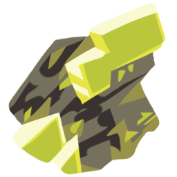

<sub>
If you're viewing this in VSCode, it's recommended that you open it in a preview with `Ctrl+Shift+V`!
</sub>

---

<br>

<center>
  <h2 style="font-size: 42px">
    
    <b>Uranium Template</b> <em>α</em>
  </h2>
  <em style="font-family: 'Comic Sans MS', 'Comic Sans', Impact, Arial">Official manual!!!!</em>
</center>
<br>

**Uranium Template** is a Love2D-inspired NotITG game development template, focusing on keeping things as **Lua-pure** as possible with enough abstractions to make you feel like you're not dealing with Stepmania jank at all.

Uranium Template originally formed during the creation of a currently unreleased project, and since then I've went ahead and refined and polished it up to be usable on its own. Most of the design decisions came from experience using prototype versions of it!

- [Installation](#installation)
- [Distribution](#distribution)
- [How do I start writing code?](#how-do-i-start-writing-code)
- [Defining actors](#defining-actors)
  - [Initializing actors](#initializing-actors)
  - [Accessing raw actors](#accessing-raw-actors)
  - [Actor-specific notes](#actor-specific-notes)
    - [`ActorFrameTexture`](#actorframetexture)
    - [`ActorFrame`](#actorframe)
    - [`ActorScroller`](#actorscroller)
    - [`BitmapText`](#bitmaptext)
    - [Textures](#textures)
  - [Shaders](#shaders)
- [Callback usage](#callback-usage)
  - [Default callbacks](#default-callbacks)
    - [`update(dt: number)`](#updatedt-number)
    - [`init()`](#init)
    - [`ready()`](#ready)
    - [`exit()`](#exit)
    - [`focus(hasFocus: boolean)`](#focushasfocus-boolean)
  - [Custom callbacks](#custom-callbacks)
- [Requiring files](#requiring-files)
- [Configuration](#configuration)
    - [`uranium.config.resetOnFrameStart(bool: boolean)`](#uraniumconfigresetonframestartbool-boolean)
    - [`uranium.config.resetActorOnFrameStart(actor: Actor, bool: boolean?)`](#uraniumconfigresetactoronframestartactor-actor-bool-boolean)
    - [`uranium.config.hideThemeActors(bool: boolean)`](#uraniumconfighidethemeactorsbool-boolean)
- [Standard library](#standard-library)
  - [Importing modules](#importing-modules)
  - [`vector2D`](#vector2d)
    - [`vector2D(x: number | nil, y: number | nil): vector2D`](#vector2dx-number--nil-y-number--nil-vector2d)
    - [`vectorFromAngle(ang: number | nil, amp: number | nil): vector2D`](#vectorfromangleang-number--nil-amp-number--nil-vector2d)
    - [`vector2D:length(): number`](#vector2dlength-number)
    - [`vector2D:lengthSquared(): number`](#vector2dlengthsquared-number)
    - [`vector2D:angle(): number`](#vector2dangle-number)
    - [`vector2D:rotate(ang: number): vector2D`](#vector2drotateang-number-vector2d)
    - [`vector2D:normalize(): vector2D`](#vector2dnormalize-vector2d)
    - [`vector2D:resize(length: number): vector2D`](#vector2dresizelength-number-vector2d)
    - [`vector2D:unpack(): number, number`](#vector2dunpack-number-number)
    - [`vector2D:distance(vect: vector2D): number`](#vector2ddistancevect-vector2d-number)
    - [`vector2D:distanceSquared(vect: vector2D): number`](#vector2ddistancesquaredvect-vector2d-number)
    - [Operations](#operations)
  - [`color`](#color)
    - [`rgb(r: number, g: number, b: number, a: number | nil): color`](#rgbr-number-g-number-b-number-a-number--nil-color)
    - [`hsl(h: number, s: number, l: number, a: number | nil): color`](#hslh-number-s-number-l-number-a-number--nil-color)
    - [`hsv(h: number, s: number, v: number, a: number | nil): color`](#hsvh-number-s-number-v-number-a-number--nil-color)
    - [`shsv(h: number, s: number, v: number, a: number | nil): color`](#shsvh-number-s-number-v-number-a-number--nil-color)
    - [`hex(hex: string): color`](#hexhex-string-color)
    - [`color:unpack(): number, number, number, number`](#colorunpack-number-number-number-number)
    - [`color:rgb(): number, number, number`](#colorrgb-number-number-number)
    - [`color:hsl(): number, number, number`](#colorhsl-number-number-number)
    - [`color:hsv(): number, number, number`](#colorhsv-number-number-number)
    - [`color:hex(): string`](#colorhex-string)
    - [`color:hue(h: number): color`](#colorhueh-number-color)
    - [`color:huesmooth(h: number): color`](#colorhuesmoothh-number-color)
    - [`color:alpha(a: number): color`](#coloralphaa-number-color)
    - [`color:malpha(a: number): color`](#colormalphaa-number-color)
    - [`color:invert(): color`](#colorinvert-color)
    - [`color:grayscale(): color`](#colorgrayscale-color)
    - [`color:hueshift(a: number): color`](#colorhueshifta-number-color)
    - [Operations](#operations-1)
  - [`easable`](#easable)
    - [`easable(default: number): easable`](#easabledefault-number-easable)
    - [`easable:set(new: number): void`](#easablesetnew-number-void)
    - [`easable:add(new: number): void`](#easableaddnew-number-void)
    - [`easable:reset(new: number): void`](#easableresetnew-number-void)
    - [Operations](#operations-2)
  - [`input`](#input)
    - [`input.inputType`](#inputinputtype)
    - [`input.directions`](#inputdirections)
    - [`input.getInputName(i: inputType): string`](#inputgetinputnamei-inputtype-string)
    - [`input.keyboardEquivalent`](#inputkeyboardequivalent)
    - [`input.getInput(i: string, pn: number | nil): number`](#inputgetinputi-string-pn-number--nil-number)
    - [`input.isDown(i: string, pn: number | nil): number`](#inputisdowni-string-pn-number--nil-number)
    - [`press(input: inputType, pn: number)`](#pressinput-inputtype-pn-number)
    - [`release(input: inputType, pn: number)`](#releaseinput-inputtype-pn-number)
    - [A note about keyboard inputs](#a-note-about-keyboard-inputs)
  - [`bitop`](#bitop)
  - [`scheduler`](#scheduler)
    - [`scheduler.schedule(when: number, func: function): number`](#schedulerschedulewhen-number-func-function-number)
    - [`scheduler.scheduleInTicks(when: number, func: function): number`](#schedulerscheduleintickswhen-number-func-function-number)
    - [`scheduler.unschedule(i: index): void`](#schedulerunschedulei-index-void)
    - [`scheduler.unscheduleInTicks(i: index): void`](#schedulerunscheduleinticksi-index-void)
  - [`binser`](#binser)
  - [`mirin`](#mirin)
    - [A note about `reset`](#a-note-about-reset)
  - [`savedata`](#savedata)
    - [`savedata.initializeModule(name: string, forceIgnore: boolean): void`](#savedatainitializemodulename-string-forceignore-boolean-void)
      - [Generating a savedata name](#generating-a-savedata-name)
    - [`savedata.s(data: table, name: string | nil): void`](#savedatasdata-table-name-string--nil-void)
    - [`savedata.save(instant: boolean): void`](#savedatasaveinstant-boolean-void)
    - [`savedata.load(): void`](#savedataload-void)
    - [`savedata.getLastSave(): string[] | nil`](#savedatagetlastsave-string--nil)
    - [`savedata.enableAutosave(): void`](#savedataenableautosave-void)
  - [`env`](#env)
    - [`env.inEditor: boolean`](#envineditor-boolean)
    - [`env.onWine: boolean`](#envonwine-boolean)
  - [`rng`](#rng)
    - [`rng.init(seed: number[] | nil): rng`](#rnginitseed-number--nil-rng)
    - [`rng(a: number | nil, b: number | nil): number`](#rnga-number--nil-b-number--nil-number)
    - [`rng:int(min: number, max: number | nil): number`](#rngintmin-number-max-number--nil-number)
    - [`rng:float(max: number | nil): number`](#rngfloatmax-number--nil-number)
    - [`rng:bool(): boolean`](#rngbool-boolean)
    - [`rng:seed(seed: number): void`](#rngseedseed-number-void)
    - [`rng:next(): number`](#rngnext-number)
    - [`rng:jump(): void`](#rngjump-void)
    - [`rng:longJump(): void`](#rnglongjump-void)
  - [`ease`](#ease)
  - [`players`](#players)
  - [`profiler`](#profiler)
  - [`util`](#util)
  - [`aft`](#aft)
  - [`noautplay`](#noautplay)
  - [`eternalfile`](#eternalfile)
  - [`uwuify`](#uwuify)
- [Examples](#examples)
  - [The obligatory](#the-obligatory)
  - [Default Uranium Template code](#default-uranium-template-code)
  - [Simple platformer base](#simple-platformer-base)
  - [AFTs](#afts)
  - [Shader test](#shader-test)
  - [Savedata example](#savedata-example)
  - [Simple ActorFrame setup](#simple-actorframe-setup)
- [Credits](#credits)

## Installation

Installation is the exact same as any other NotITG template:

0. Get the latest template version from [the Gitea releases page](https://git.oat.zone/oat/uranium-template/releases)
1. Unzip your installation zip, as you would a modfile
2. Edit `Song.sm` in your editor of choice (ArrowVortex, NotITG) to include necessary metadata; replace `silence.ogg` with an actual track, if necessary
3. Edit `main.lua` to do whatever you wish to do with it! The entirety of the `src/` folder is yours!
4. _(Recommended)_ Install [sumneko's Lua LSP](https://marketplace.visualstudio.com/items?itemName=sumneko.lua) and grab the latest NotITG typings [here](https://gitlab.com/CraftedCart/notitg_docs/-/archive/master/notitg_docs-master.zip?path=lua) (put them in a folder like `.typings`!)

## Distribution

After you're done with writing your file, be sure to take these steps to reduce the filesize and get your game ready for zipping up!

- Remove `MANUAL.md`, `docs/`, `.vscode/`, `.gitconfig`, `.gitignore` and `template/typings.lua`. These are files that aren't necessary outside of a development environment!
- Optionally, remove `Song.sm.auto` and `Song.sm.old`. These files may not exist depending on certain factors.
- If you've followed step 4 during [Installation](#installation), be sure to remove your typings folder (likely `.typings`)
- If you're using Git, **PLEASE REMOVE YOUR `.git/` FOLDER!!!**

If you're on Linux or have MSYS2/WSL/similar installed, you can use the [distribution script](distribute-file.sh).

Afterwards, it should be safe to zip everything up and send it over!

## How do I start writing code?

`main.lua` is the entry-point for your code! From there, you can do the following:

- [Define some actors](#defining-actors), and [call initialization methods on those actors](#initializing-actors) to set them up
- [Define callbacks](#callback-usage), such as the [update](#updatedt-number) callback
- [Require more files in](#requiring-files)! Splitting your code into neat little modules is always good practice.
- Make use of the expansive [standard library](#standard-library), like the [vector](#vector2d) or [color](#color) classes

If you're still a bit clueless, why not check out the [Examples](#examples) section?

## Defining actors

Actors are defined in Uranium Template before any other callback runs, and are defined by a single function of their type:

```lua
local quad = Quad()
local sprite = Sprite('file/location.png')
local text = BitmapText('common', 'hello, world!')
```

All actors that take in filenames have their filenames starting from the root of the project; meaning if you had a file in `myModFile/src/test.png`, you'd have to pass in a filename of `src/test.png`. **If an image is blank, or a single pink pixel, it hasn't loaded properly.**

### Initializing actors

Once you have an actor defined, you can run whatever methods you want.

> **Note**
> Even though you get a fully functional actor, what you actually get is a _proxied actor_! What this means for you is that you really shouldn't call any getters on the actor, as it'll just return `nil`.

```lua
local text = BitmapText('common', 'hello, world!')
text:xy(scx, scy)
text:zoom(2.3)
text:rotationz(30)
text:diffuse(1, 0.8, 0.8, 1)
```

All methods that you run upon definition will be ran again at the start of every frame with `uranium.config.resetOnFrameStart`:

```lua
uranium.config.resetOnFrameStart(true)

local quad = Quad()
quad:xy(scx, scy)
quad:zoomto(60, 60)
quad:diffusealpha(1)

uranium.on('update',
  -- doesn't need a reset! it'll automatically zoomto 60, 60 and set its alpha to 1
  quad:Draw()
  quad:zoomto(120, 120)
  quad:diffusealpha(0.5)
  quad:Draw()
end)
```

If you want to avoid this for individual actors, or otherwise call getter methods, use the [`init`](#init) callback:

```lua
local sprite = Sprite()

uranium.on('init', function()
  someTexture = sprite:GetTexture()
end)
```

Alternatively, you can also use the actors' individual `InitCommand`s:
```lua
local sprite = Sprite()
sprite:addcommand('Init', function(self)
  someTexture = self:GetTexture()
end)
```

Or, you can disable the frame resetting functionality individually:
```lua
uranium.config.resetOnFrameStart(true)
local sprite = Sprite()
uranium.config.resetActorOnFrameStart(sprite, false)
sprite:Draw() -- will not be called per-frame
```

### Accessing raw actors

As you may have noticed, when you print an actor defined with Uranium, it won't show up as an actor - it'll show up as a "proxy" of an actor. This is because we can't actually get actors created on demand in NotITG - what happens instead is you get an object that _acts_ like an actor by calling all the same methods you pass into it, but isn't really one.

```lua
local q = Quad()
print(q) --> 'Proxy of Quad'
```

Typically, this doesn't matter; however, in certain contexts, it may be required for you to get the raw actor from a proxy actor. You can do this by accessing `__raw` on the actor - this is defined on all actors and is only available _post-initialization_.

```lua
local q = Quad()
print(q.__raw) --> nil
q:addcommand('Init', function()
  print(q.__raw) --> 'Sprite (168F7F78)'
end)
```

For most things that require this, there exist simple abstractions - applying shaders has `setShader`, `setShaderfuck`, etc., however in rare circumstances this may be useful. _Please let me know if there's a use-case that I haven't accounted for!_

### Actor-specific notes

#### `ActorFrameTexture`

AFTs work in the same way as usual AFTs do in terms of ordering: they capture everything that was drawn to the screen before them:

```lua
quad:Draw() -- will be drawn to the AFT

aft:Draw()

sprite:Draw() -- will not be drawn to the AFT
```

See [the AFT example](#afts) for a quick setup to play around with, or the example in the [aft library](#aft) for a barebones setup. The ability to dynamically adjust at which point in the stack they render makes them _a lot_ more powerful than you'd expect.

#### `ActorFrame`

To create an `ActorFrame`, first define it as a proper actor:

```lua
local af = ActorFrame()
```

Then, for all children that you want to put into the `ActorFrame`, run `addChild`:

```lua
local quad = Quad()
addChild(af, quad)
local sprite = Sprite()
addChild(af, sprite)
```

**This will mess up rendering for those actors!** This is because all actors that are outside the _root_ `ActorFrame` of the template would be unaffected with the frame's transformations if they're drawn outside of their respective DrawFunctions. You'd want to then create a setup similar to this:

```lua
setDrawFunction(af, function() -- necessary to call this instead of af.SetDrawFunction for template internals reasons
  quad:Draw()
  sprite:Draw()
end)

uranium.on('update', function()
  af:Draw() -- would draw quad and sprite
end)
```

**Nested AFs are supported.** As with all complicated things in this template, check out the [`ActorFrame` example](#simple-actorframe-setup) for a simple working setup.

An additional extra feature Uranium Template adds to assist with rendering multiple instances is the ability to pass in arguments through `Draw()`:

```lua
setDrawFunction(af, function(x, y)
  quad:xy(x, y)
  quad:Draw()
end)

uranium.on('update', function()
  for x = 0, 3 do
    for y = 0, 3 do
      af:Draw(x, y)
    end
  end
end)
```

#### `ActorScroller`

`ActorFrame` already has an extremely, _extremely_ complicated setup powering it in the back-end; and `ActorScroller` is way too niche for me to give it the same treatment. Sorry!

#### `BitmapText`

If you want to specify theme-provided fonts, that's easy enough:

```lua
local text1 = BitmapText(nil, 'test') -- defaults to 'common'
local text2 = BitmapText('_wendy white', 'test')
local text3 = BitmapText('_misobold white', 'test')
```

However, providing custom fonts is a bit tedious due to a [vanilla bug](https://discord.com/channels/227650173256466432/666629297544495124/1023573412028891177) that's annoying to work around. In order to specify a custom font, consider the _root path_ to be in `template/`. For example, if you want to load a font from your `src/` folder, you'd do:

```lua
local text = BitmapText('../src/_inter v 22px.ini', 'test')
```

#### Textures

For convinience, `Texture` is a function that will give you a `RageTexture` from a filename without the actor. Equivalent to:

```lua
local sprite = Sprite('filename.png')
sprite:hidden(1)
local texture = sprite:GetTexture()
return texture
```

### Shaders

Shaders cannot be manually defined on actors [due to a technical limitation](https://discord.com/channels/227650173256466432/666629297544495124/1022119161415077909); plus, it wouldn't make much sense to integrate them in the same way that NotITG integrates shaders with the current XML behavior. In order to give an actor a shader, you need to define them seperately:

```lua
local sprite = Sprite('docs/uranium.png')
local shader = Shader('src/shader.frag') -- returns a RageShaderProgram
```

Afterwards, call `setShader` on your actor. You can call this outside of `init`, if you like.

```lua
setShader(actor, shader)
-- or
setShaderfuck(shader)
-- (don't forget to clearShaderfuck())
```

If you prefer, you can also inline shader code, as long as you don't mix files with inlined code in the same shader:

```lua
local shader = Shader([[
  #version 120

  void main() {
    gl_FragColor = vec4(0.420, 0.69, 1.0, 1.0);
  }
]])
```

Defining vertex shaders is done the same way, except with the second argument instead:

```lua
local shader = Shader('src/shader.frag', 'src/shader.vert')
```

To define a vertex shader and nothing else, you'll need to omit the fragment shader and put a `nil` in its place:

```lua
local shader = Shader(nil, 'src/shader.vert')
```

And last, if you want a no-op shader, you can just do a simple:
```lua
local noopShader = Shader()
```

Check [the shader example](#shader-test) if you just want something to play around with.

## Callback usage

Callbacks are defined with `uranium.on`:

```lua
uranium.on('update', function(dt)
  -- runs every frame
end)
```

You can do this as many times as you like - it'll call every single function that's defined as `update`, not just the last!

If you return a non-falsy value in a callback, however, it'll cancel every other callback after it. This can be useful for, eg. capturing inputs and ensuring they don't get passed through to other callbacks on accident.

### Default callbacks

These are the callbacks that are built into Uranium:

#### `update(dt: number)`
Called every frame. `dt` is the time passed since the last frame, the "deltatime".

#### `init()`
Called once on `OnCommand`. Every actor has been created, and the game should be starting shortly.

#### `ready()`
Fired on the first tick. A later version of `init()` where more things should be safe to use.

#### `exit()`
_Should_ call when the player exits the file. **Not properly tested yet.**

#### `focus(hasFocus: boolean)`
Called whenever the window loses/gains focus. You can use this to reduce render quality on alt-tab.

### Custom callbacks

Custom callbacks require no extra setup. Define your callback like usual:

```lua
uranium.on('somethingHappened', function(value)
  -- ...
end)
```

Then all you need to do to call it is:

```lua
uranium:call('somethingHappened', extra, values, go, here)
```

Callbacks support as many extra values as Lua supports arguments in a function - so let's just say you won't be running out of them any time soon.

## Requiring files

`require` in Uranium works a lot like Lua's vanilla `require`, and is a direct copy of Mirin's `require`.

Say you have a file structure like this:

`src/main.lua`
```lua
local value = require('test')
print(value)
```

`src/test.lua`
```lua
return 'hello!'
```

Your setup would print `'hello!'`.

All [standard library](#standard-library) modules are required with `require`, see further notes in [**Importing modules**](#importing-modules).

## Configuration

Uranium Template's base functionality can be configured using `uranium.config`. You can access the raw values by requiring `uranium.config`, but this is currently undocumented.

#### `uranium.config.resetOnFrameStart(bool: boolean)`

Toggle actor resetting on frame start behavior by default. _(Default: `false`)_

#### `uranium.config.resetActorOnFrameStart(actor: Actor, bool: boolean?)`

Toggle actor resetting on frame start for individual actors. `bool` defaults to the opposite of your `resetOnFrameStart` config.

#### `uranium.config.hideThemeActors(bool: boolean)`

Toggle if theme actors (lifebars, scores, song names, etc.) are hidden. Must be toggled **before** `init`. _(Default: `true`)_

## Standard library

The Uranium Template standard library is split up into a few convinient modules. This section aims to comprehensively document them all.

### Importing modules

You can import a module like so:

```lua
require('stdlib.vector2D')

-- can use vector() here
```

Some modules won't export any globals, and therefore need to be loaded like so:

```lua
uwuify = require('stdlib.uwuify')
print(uwuify('hello!'))
```

These modules have a label near their header in this manual reading _"Exports globals"_.

### `vector2D`

_Exports globals_

`vector2D` is a simple 2D vector class system. For example, to define a vector:
```lua
local vec = vector2D(0, 0)
-- or
local vec = vector(0, 0)
-- or
local vec = vector(0)
-- or
local vec = vector()
```

Then add another vector to it:
```lua
vec = vec + vector(1)
print(vec) --> (1, 1)
```

Then measure its length:
```lua
local len = vec:length()
print(len) --> 1.4142135623730951
           --  (sqrt of 2)
```

Then rotate it and index it:
```lua
vec:rotate(180)

local x = vec.x
-- or
local x = vec[1]

print(x) --> -1
```

#### `vector2D(x: number | nil, y: number | nil): vector2D`

Creates a new vector. If only `x` is passed in, `y` = `x`. If no arguments are passed, `x` = `y` = `0`.

#### `vectorFromAngle(ang: number | nil, amp: number | nil): vector2D`

Creates a new vector pointing in a specific angle. **Specify `ang` in degrees.** `ang` defaults to 0, `amp` defaults to 1.

#### `vector2D:length(): number`

Returns the vector's length. Equal to `vector:distance(vector())`.

#### `vector2D:lengthSquared(): number`

Returns the vector's length, squared. Here mainly for optimization purposes; this is a cheaper version of [`length()`](#vectorlength-number) that's less accurate.

#### `vector2D:angle(): number`

Returns the vector's angle in degrees.

#### `vector2D:rotate(ang: number): vector2D`

Rotates the vector, setting its angle but keeping its length. _Angle is provided in degrees._

#### `vector2D:normalize(): vector2D`

Normalizes the vector, setting its length to 1 but keeping its angle. Equal to `vector:resize(1)`

#### `vector2D:resize(length: number): vector2D`

Resizes the vector, setting its length but keeping its angle.

#### `vector2D:unpack(): number, number`

Unpacks the vector into its X and Y coordinates. Useful for quickly unpacking it into a function call:
```lua
local quad = Quad()
quad:xy(center:unpack())
```

#### `vector2D:distance(vect: vector2D): number`

Gets the distance between one vector and another.

#### `vector2D:distanceSquared(vect: vector2D): number`

Gets the distance between one vector and another, squared. Here mainly for optimization purposes; this is a cheaper version of [`distance()`](#vectordistancevect-vector-number) that's less accurate.

#### Operations

Here are all valid operations for vectors:

- `vector2D + number`: equal to `vector2D + vector2D(number)`
- `vector2D + vector2D`: adds the vectors' X and Y coordinates together, respectively, forming a new vector
- `vector2D - number`: equal to `vector2D - vector2D(number)`
- `vector2D - vector2D`: subtracts the vectors' X and Y coordinates, respectively, forming a new vector
- `vector2D * number`: equal to `vector2D * vector2D(number)`
- `vector2D * vector2D`: multiplies the vectors' X and Y coordinates together, respectively, forming a new vector
- `vector2D / number`: equal to `vector2D / vector2D(number)`
- `vector2D / vector2D`: divides the vectors' X and Y coordinates, respectively, forming a new vector
- `vector2D == vector2D`: checks if the two vectors' X and Y coordinates are equivalent; returns false with any other type
- `-vector2D`: negates the X and Y coordinates of the vector

### `color`

_Exports globals_

`color` is a simple wrapper around all things color-related.

#### `rgb(r: number, g: number, b: number, a: number | nil): color`

Constructs a new color using the `r`, `g`, `b` and `a` values. Assumes all values are contained in the set [0, 1]. `a` defaults to 1.

#### `hsl(h: number, s: number, l: number, a: number | nil): color`

Constructs a new color using the `h`, `s`, `l` and `a` values using the [HSL color model](https://en.wikipedia.org/wiki/HSL_and_HSV). Assumes all values are contained in the set [0, 1]. `a` defaults to 1; `h` wraps around.

#### `hsv(h: number, s: number, v: number, a: number | nil): color`

Constructs a new color using the `h`, `s`, `v` and `a` values using the [HSV color model](https://en.wikipedia.org/wiki/HSL_and_HSV). Assumes all values are contained in the set [0, 1]. `a` defaults to 1; `h` wraps around.

#### `shsv(h: number, s: number, v: number, a: number | nil): color`

Equal to [`hsv()`](#hsvh-number-s-number-v-number-a-number--nil), except the hue value is smoothed using cubic smoothing. Not accurate, but produces neater-looking color blends for rainbow-shifting colors.

```lua
local rainbow = shsv(t, 1, 0.5)
```

#### `hex(hex: string): color`

Reads in a hex string and parses it into a `color`. Accepted hex string formats are `#ffffff`, `ffffff`, `#fff` and `fff`.

#### `color:unpack(): number, number, number, number`

Unpacks the color into its R, G, B and A values. Useful for `diffuse`:
```lua
local quad = Quad()
quad:diffuse(col:unpack())
```

#### `color:rgb(): number, number, number`

Returns the color's R, G and B values.

#### `color:hsl(): number, number, number`

Returns the color's H, S and L values in the [HSL color model](https://en.wikipedia.org/wiki/HSL_and_HSV).

#### `color:hsv(): number, number, number`

Returns the color's H, S and V values in the [HSV color model](https://en.wikipedia.org/wiki/HSL_and_HSV).

#### `color:hex(): string`

Returns the color's hex string representation in the format `ffffff`.

#### `color:hue(h: number): color`

Sets the color's hue value in the [HSL/HSV color model](https://en.wikipedia.org/wiki/HSL_and_HSV).

#### `color:huesmooth(h: number): color`

Equivalent to [`color:hue()`](#colorhueh-number-color), except the hue value is smoothed using cubic smoothing. Not accurate, but produces neater-looking color blends for rainbow-shifting colors.

#### `color:alpha(a: number): color`

Sets the color's alpha channel.

#### `color:malpha(a: number): color`

Sets the color's alpha channel, multiplying the previous value with `a`.

#### `color:invert(): color`

Inverts the color.

#### `color:grayscale(): color`

Makes the color grayscale using a more accurate formula than just multiplying every value by `0.5`.

#### `color:hueshift(a: number): color`

Shifts the color's hue by `a`.

#### Operations

Here are all valid operations for colors:

- `color + number`: equal to `color + rgb(number, number, number)`
- `color + color`: adds the colors' R, G and B values together, respectively, forming a new color
- `color - number`: equal to `color - rgb(number, number, number)`
- `color - color`: subtracts the colors' R, G and B values, respectively, forming a new color
- `color * number`: equal to `color * rgb(number, number, number)`
- `color * color`: multiplies the colors' R, G and B values together, respectively, forming a new color
- `color / number`: equal to `color / rgb(number, number, number)`
- `color / color`: divides the colors' R, G and B values, respectively, forming a new color
- `color == color`: checks if the two colors' R, G and B values are equivalent; returns false with any other type

### `easable`

A simple way of making a number easable. See [this post](https://blog.oat.zone/the-easy-and-memorable-solution-to-easing/) for implementation details.

```lua
local easable = require('stdlib.easable')

local n = easable(0)

-- each time you want to set it, call this instead
n:set(value)
-- or
n:add(value)

-- to avoid the ease, do this instead
n:reset(value)

-- then, in your update function
uranium.on('update', function(dt)
  n(dt) -- multiply this image by some value to speed it up
  print(n.a) -- retrieve the eased value
  print(n.toa) -- retrieve the target value it's easing towards
end)
```

#### `easable(default: number): easable`

Creates a new easable, setting the default to `default`. Can technically be anything that has `T * number`, `number - T` and `T + T` defined, including a `vector2D`.

#### `easable:set(new: number): void`

Sets the target value (`toa`) to `new`, easing the current value to the new value.

#### `easable:add(new: number): void`

Equivalent to `easable:add(easable.toa + new)`.

#### `easable:reset(new: number): void`

Sets the current (`a`) and target (`toa`) values to `new`, **not** easing the current value to the new value.

#### Operations

Every operation supported on the eased value is supported with an `easable`.

### `input`

_Defines callbacks_

`input` is the library that handles everything input-related. Its main feature is providing the `press` and `release` callbacks, but you can also access the raw inputs with the `inputs` table (each value is `-1` if the key is not pressed and the time at which it was pressed, estimated with `t` if it is pressed) and the _raw_ inputs (ignoring callback returns) with `rawInputs`.

#### `input.inputType`

The `input` module can detect every input that the game can pass through the [`StepP<player><input><action>MessageCommand`](https://craftedcart.gitlab.io/notitg_docs/message_commands.html#stepp-player-input-action-messagecommand). This list is:
```
MenuLeft
MenuRight
MenuUp
MenuDown
Start
Select
Back
Coin
Operator
Left
Right
Up
Down
UpLeft
UpRight
ActionLeft
ActionRight
ActionUp
ActionDown
Action1
Action2
Action3
Action4
Action5
Action6
Action7
Action8
MenuStart
```

All of these inputs are neatly stored away in an enum called `inputType`. For instance, if you wanted to check if an input was `Start`, you would do:

```lua
local isStart = i == input.inputType.Start
```

#### `input.directions`

For your convinience, cardinal inputs are given a simple directions enum:
```lua
self.directions = {
  [self.inputType.Left] = {-1, 0},
  [self.inputType.Down] = {0, 1},
  [self.inputType.Up] = {0, -1},
  [self.inputType.Right] = {1, 0}
}
```

#### `input.getInputName(i: inputType): string`

Gets the name of an input. The reverse of indexing the `inputType` enum.

#### `input.keyboardEquivalent`

Mappings for the default keybinds for most keys. It's recommended to put them alongside the in-game representation in UIs to avoid confusion:

```lua
local inputName = input.getInputName(i)
local keyboardInput = input.keyboardEquivalent[i]
if keyboardInput then
  inputName = inputName .. ' (defaults to ' .. keyboardInput .. ')'
end
local dialog = 'Press ' .. inputName .. ' to boop' --> 'Press Start (defaults to Enter) to boop'
```

#### `input.getInput(i: string, pn: number | nil): number`

Shorthand for accessing `input.inputs` directly. If `pn` is not provided, it gets either of the players' inputs, prioritizing any that are held down.
```lua
input.inputs[1][input.inputType.Left] == input.getInput('Left', 1)
```

#### `input.isDown(i: string, pn: number | nil): number`

Shorthand for `input.getInput(i, pn) ~= -1`. If `pn` is not provided, players are ignored and it checks if either of the players have the input held down

#### `press(input: inputType, pn: number)`
Called when a player presses on a certain key.

#### `release(input: inputType, pn: number)`
Same as [`press`](#pressinput-inputtype), except for releasing a key.

#### A note about keyboard inputs

Working with left/down/up/right inputs can be tiring at times and it's hard to always fit designs to work with them. However, if you're willing to take a little compromise, you can also _access all keyboard inputs_. However, it's worth noting that this **depends on NotITG's Simply Love** (any forks will work fine too) both for your development environment and for all players. That being said, if you want to access the keyboard API, this is how you do it:

```lua
-- check if the user is using simply love at all
if not stitch then error('This modfile requires the Simply Love theme! https://github.com/TaroNuke/Simply-love-NotITG-ver.-') end

keyboard = stitch('lua.keyboard')

-- table that contains every keyboard key as the key and a boolean as the value
local buffer = keyboard.buffer
-- for example:
local isDebugKeyHeld = buffer['F3']

-- contains booleans for shift, ctrl, alt, win and altgr
local special = keyboard.special
local isDebugKeyAndShiftHeld = isDebugKeyHeld and special.shift
```

### `bitop`

A Lua 5.0 port of [bitop-lua](https://github.com/AlberTajuelo/bitop-lua). See their repository for documentation.

```lua
local bitop = require('stdlib.bitop')
```

### `scheduler`

_Defines callbacks_

A simple scheduler.

```lua
local scheduler = require('stdlib.scheduler')
```

#### `scheduler.schedule(when: number, func: function): number`

Schedules a function to run in a specific amount of time. `when` is in seconds.

#### `scheduler.scheduleInTicks(when: number, func: function): number`

Schedules a function to run in a specific amount of `update` calls/ticks.

#### `scheduler.unschedule(i: index): void`

Unschedules a function. Use the index returned to you when originally scheduling the function.

#### `scheduler.unscheduleInTicks(i: index): void`

Unschedules a function in ticks. Use the index returned to you when originally scheduling the function.

### `binser`

A NITG port of [binser](https://github.com/bakpakin/binser). Used for [savedata](#savedata) serialization.

```lua
local binser = require('stdlib.binser')

local mydata = binser.serialize(45, {4, 8, 12, 16}, 'Hello, World!')

print(binser.deserializeN(mydata, 3))
-- 45	table: 0x7fa60054bdb0	Hello, World!
```

If you want to serialize custom types using the savedata module, check binser's [Custom types](https://github.com/bakpakin/binser#custom-types) section.

### `mirin`

_Defines callbacks_

_Exports globals_

A copy of the [Mirin Template by XeroOl](https://github.com/XeroOl/notitg-mirin/) (currently at 5.0.1), shoved in and ported for your convinience. Works exactly the same as regular Mirin.

#### A note about `reset`

Both Uranium Template and Mirin Template contain the global `reset` - Mirin Template uses it for mod resetting, while Uranium Template uses it for actor resetting. To avoid this collision, Uranium's `reset` has an alias called `resetActor`; Mirin will, by default, overwrite the usual `reset`. There's currently no way to change this.

### `savedata`

_Defines callbacks_

A complete library for saving and loading arbitrary data to the user's profile. Uses [binser](#binser) for serialization. See [Savedata example](#savedata-example) for an example of how to use this library.

#### `savedata.initializeModule(name: string, forceIgnore: boolean): void`

Initializes the savedata module. `forceIgnore` makes the function ignore name checks, **but please don't use it unless you know what you're doing!!!**

##### Generating a savedata name

Ideally, you'd generate a savedata name by [generating a random 16-character string](https://www.random.org/strings/?num=1&len=16&digits=on&upperalpha=on&loweralpha=on&unique=on&format=plain&rnd=new) and appending it to your game's name. For instance:

```lua
savedata.initializeModule('myGameName_doAmaUOBIjiaSWyz')
```

The reason this is done is to avoid name collision - all modfiles share a global profile namespace to put their saved data in. To prevent it as much as possible, I've decided to force the user to generate a unique name that _most likely_ won't be taken by anything else. `forceIgnore` completely ignores the 16-character and special/normal character checks.

#### `savedata.s(data: table, name: string | nil): void`

Creates a new module in your savedata. It uses `data` for defaults, then uses it for writing savedata to it and reading savedata from it; for instance, this would be correct usage:

```lua
local counter = {
  n = 0
}

savedata.s(counter)

uranium.on('init', function()
  print(counter.n) --> could be different from 0!
end)

uranium.on('update', function()
  counter.n = counter.n + 1 -- this will be saved the next time savedata.save is called
end)
```

By default, the name that's used for your module will be the folder your Lua file is located in, followed by its filename. **This means you should not rely on the automatic name generation if your Lua file rests at the root of your file or if you're calling this function via `loadstring` or similar** as it will create unpredictable module names that will change between setups and sometimes even game restarts. You can pass in any string you like to `name`, as long as it's unique in your project, to override this behavior.

#### `savedata.save(instant: boolean): void`

Saves the savedata onto the user's profile. It waits a single tick to do so and sets the boolean `saveNextFrame` to `true`; this is so that your game can display a loading frame for the temporary lagspike, as chances are, on lower-end setups with hard drives, this will momentarily freeze the game as it writes the profile. You can make it instantly save with `instant`.

#### `savedata.load(): void`

Loads the savedata. _Shouldn't be called manually; this is automatically called on [`init()`](#init)._

#### `savedata.getLastSave(): string[] | nil`

Gets the last save time that persists between game restarts in the format `{hour, minute, date, month, year}`. If the game has not saved once, returns `nil`.

#### `savedata.enableAutosave(): void`

Enables autosave via [`exit()`](#exit). Should hopefully mean data should never get lost.

### `env`

Small module that contains a bit of information about the user's environment.

#### `env.inEditor: boolean`

Is `true` if the file is being played in the editor. Useful for debugging stuff.

#### `env.onWine: boolean`

Is `true` if the player is playing NotITG through Wine or similar.

### `rng`

A xoshiro128** reimplementation in Lua.

#### `rng.init(seed: number[] | nil): rng`

Initializes a new RNG class. `seed` must be a table of size 4; if it is not provided, `os.time()` is used in its place. _(Not `os.clock()`!!! Two RNG values created at the same time with no provided seed will be the same.)_

#### `rng(a: number | nil, b: number | nil): number`

Acts identical to `math.random()`. Pass in no arguments to get a random float from 0 to 1, pass in one argument to get a random inclusive integer from 1 to `a`, pass in two arguments to get a random integer from `a` to `b`.

#### `rng:int(min: number, max: number | nil): number`

Generates an inclusive random integer. Pass in one argument to get a random integer from 1 to `a`, pass in two arguments to get a random integer from `a` to `b`.

#### `rng:float(max: number | nil): number`

Generates a random fractional number from `0` to `max`. `max` defaults to 1.

#### `rng:bool(): boolean`

Generates either a `true` or a `false` randomly.

#### `rng:seed(seed: number): void`

Sets the seed and advances the state.

#### `rng:next(): number`

Gets the next pseudo-random value. Recommended to use [`int`](#rngintmin-number-max-number-number), [`float`](#rngfloatmax-number--nil-number), etc. over this.

#### `rng:jump(): void`

The jump function:

> This is the jump function for the generator. It is equivalent
> to 2^64 calls to next(); it can be used to generate 2^64
> non-overlapping subsequences for parallel computations.

#### `rng:longJump(): void`

The long-jump function:

> This is the long-jump function for the generator. It is equivalent to
> 2^96 calls to next(); it can be used to generate 2^32 starting points,
> from each of which jump() will generate 2^32 non-overlapping
> subsequences for parallel distributed computations.

### `ease`

_Exports globals_

A direct copy of [Mirin Template's `ease.lua`](https://github.com/XeroOl/notitg-mirin/blob/master/template/ease.lua), for convinience. See the docs for those [**here**](https://xerool.github.io/notitg-mirin/docs/eases.html).

### `players`

_Exports globals_

Pulls in the players as `P[1-8]` and `P<1-8>`.

```lua
require('stdlib.players')
P1:hidden(1)
P2:hidden(1)
```

### `profiler`

_Defines callbacks_

A simple profiler for Uranium Template's callback system. Require it and it'll display in the left-top corner of your screen, showing what callback functions are taking the longest to run.

### `util`

_Exports globals_

A big ol' module that holds a bunch of useful functions. These were too specific or too niche to go in any singular module; so they're all here now.

There's _a bit too many_ functions to document, so I'd recommend just looking through the source code. I promise it doesn't bite.

### `aft`

An AFT setup library. Sets up sprites and AFTs with `sprite` and `aft`, respectively, making them ready for texturing use.

```lua
local aftSetup = require('stdlib.aft')

local aft = ActorFrameTexture()

local aftSprite = Sprite()
aftSetup.sprite(aftSprite)

aft:addcommand('Init', function(self)
  aftSetup.aft(aft) -- put this here; else it'll recreate it every frame!
  aftSprite:SetTexture(self:GetTexture())
end)
```

### `noautplay`

A single function which can be called before `ready()` to disable autoplay for the duration of the file if the player has it on. ***Not tested.***

```lua
require('stdlib.noautoplay')()
```

### `eternalfile`

A single function which turns your file into an eternal, neverending file, until the player puts it out of its misery by exiting. The current beat will always go from 0 to 1 and start over once this is enabled. This also sets the notedata to nothing to avoid hitting padding mines.

```lua
require('stdlib.eternalfile')()
```

### `uwuify`

```lua
uwuify = require('stdlib.uwuify')
print(uwuify('hello, world!')) --> hewwo, wowwd!
```

_A very important library I don't see enough game engines include in their standard libraries._

## Examples

Here are a couple of examples. All of these are standalone `main.lua` files that you can plug in and view the results of!

### The obligatory
```lua
local text = BitmapText('common', 'Hello, world!')
text:xy(scx, scy)

uranium.on('update', function()
  text:Draw()
end)
```

### Default Uranium Template code
```lua
require('stdlib.color')
require('stdlib.players')
P1:hidden(1)
P2:hidden(2)
require('stdlib.eternalfile')()

-- define a basic quad
local quad = Quad()
quad:xy(scx, scy)
quad:zoom(120)
quad:diffuse(0.8, 1, 0.7, 1)
quad:skewx(0.2)
uranium.config.resetActorOnFrameStart(quad)

-- define a sprite
local sprite = Sprite('docs/uranium.png')
sprite:xy(scx, scy)
sprite:zoom(0.4)
sprite:glow(1, 1, 1, 0)

-- let's add some text aswell
local text = BitmapText('common', 'hello, uranium template!')
text:xy(scx, scy + 100)

-- update gets called every frame
-- dt here refers to deltatime - the time that has passed since the last frame!
uranium.on('update', function(dt)
  -- let's rotate our quad
  quad:rotationz(t * 80)
  -- then shove it to the screen - similar to a drawfunction!
  quad:Draw()
  -- and you can do this multiple times of course!
  quad:zoomto(180, 180)
  quad:rotationz(t * 100)
  quad:diffusealpha(0.4)
  quad:skewx(0.1)
  quad:Draw()
  -- no need to reset properties - uranium resets all properties that you set upon definition!

  -- throw in the logo aswell, because why not
  -- zoom and glow is done for a quick-and-dirty outline
  sprite:zoom(sprite:GetZoom() * 1.1)
  sprite:glow(1, 1, 1, 1)
  sprite:Draw()
  -- if you can't wait until the start of a frame to reset properties, you can manually do it
  reset(sprite)
  sprite:Draw()

  -- for the text, get a rainbow color
  local col = shsv(t * 0.6, 0.5, 1)
  text:diffuse(col:unpack()) -- the :unpack() is necessary when passing into :diffuse()
  -- wag the text
  text:rotationz(math.sin(t * 2) * 10)
  text:Draw()
end)
```

### Simple platformer base
```lua
require('stdlib.vector2D')
local input = require('stdlib.input')

-- constants are just those that felt nice to me. this is completely valid to do in gamedev
local DAMPING = 1/9500
local SPEED = 2
local JUMP_FORCE = 32
local GRAVITY = 123
local PLAYER_SIZE = 50

local groundY = sh * 0.8

local protagActor = Quad()
protagActor:zoomto(PLAYER_SIZE, PLAYER_SIZE)
local ground = Quad()
ground:zoomto(sw, 4)
ground:xy(scx, groundY + PLAYER_SIZE/2 + 4/2)

local coverQuad = Quad()
coverQuad:diffuse(0, 0, 0, 0.6)
coverQuad:xywh(scx, scy, sw, sh)

local pos = vector(scx, groundY)
local vel = vector(0, 0)
local hasHitGround = true -- let's define this so that you can't jump mid-air

-- called whenever the player recieves an input
uranium.on('press', function(i)
  if i == input.inputType.Up and hasHitGround then
    vel.y = vel.y - JUMP_FORCE
    hasHitGround = false
    return true -- input eaten! further callbacks won't recieve this
  end
end)

uranium.on('update', function(dt)
  -- respond to l/r inputs
  if input.isDown('Left') then
    vel.x = vel.x - SPEED
  end
  if input.isDown('Right') then
    vel.x = vel.x + SPEED
  end

  -- apply gravity
  vel.y = vel.y + GRAVITY * dt

  -- update position, apply damping to velocity
  pos = pos + vel
  vel = vel * math.pow(DAMPING, dt)

  -- make sure the player can't clip through the ground
  if pos.y >= groundY then
    pos.y = groundY
    if vel.y >= 0 then vel.y = 0 end
    hasHitGround = true
  end

  -- make sure the player can't leave the screen on accident
  pos.x = math.min(pos.x, sw - PLAYER_SIZE/2)
  pos.x = math.max(pos.x, 0  + PLAYER_SIZE/2)

  -- slightly cover up the regular nitg gameplay
  coverQuad:Draw()

  -- draw them!
  protagActor:xy(pos.x, pos.y)
  protagActor:Draw()

  -- draw the ground
  ground:Draw()
end)
```

### AFTs

_VSync recommended_

```lua
local aftSetup = require('stdlib.aft')
require('stdlib.color')
require('stdlib.vector2D')

local coverQuad = Quad()
coverQuad:diffuse(0, 0, 0, 1)
coverQuad:xywh(scx, scy, sw, sh)

local testQuad = Quad()
testQuad:zoom(50)

local aft = ActorFrameTexture()

local aftSprite = Sprite()
aftSetup.sprite(aftSprite)
aftSprite:diffusealpha(0.99)
aftSprite:zoom(1.01)
aftSprite:rotationz(0.2)

aft:addcommand('Init', function(self)
  aftSetup.aft(aft) -- put this here; else it'll recreate it every frame!
  aftSprite:SetTexture(self:GetTexture())
end)

local text = BitmapText('common', 'uranium template!')
text:xy(scx, scy)

uranium.on('update', function(dt)
  coverQuad:Draw()

  aftSprite:Draw()

  local rainbow = shsv(t * 1.2, 0.5, 1)

  testQuad:xy((vectorFromAngle(t * 160, 100) + vector(scx, scy)):unpack())
  testQuad:diffuse(rainbow:unpack())
  testQuad:zoom(50 * math.random())
  testQuad:Draw()

  aft:Draw()

  text:Draw()
end)
```

### Shader test

```lua
-- define a sprite
local sprite = Sprite('docs/uranium.png')
sprite:xy(scx, scy)
sprite:zoom(0.4)
sprite:rotationz(0)
sprite:diffusealpha(1)

-- add our heat shader
local shader = Shader([[
#version 120

// took the common heat.frag and integrated simplex noise into it
// now it looks better -oat

uniform float tx,ty,yo;
uniform float scale;

varying vec2 textureCoord;
varying vec4 color;
uniform sampler2D sampler0;

vec2 hash( vec2 p ) // replace this by something better
{
	p = vec2( dot(p,vec2(127.1,311.7)), dot(p,vec2(269.5,183.3)) );
	return -1.0 + 2.0*fract(sin(p)*43758.5453123);
}

float noise( in vec2 p )
{
  const float K1 = 0.366025404; // (sqrt(3)-1)/2;
  const float K2 = 0.211324865; // (3-sqrt(3))/6;

	vec2  i = floor( p + (p.x+p.y)*K1 );
  vec2  a = p - i + (i.x+i.y)*K2;
  float m = step(a.y,a.x); 
  vec2  o = vec2(m,1.0-m);
  vec2  b = a - o + K2;
	vec2  c = a - 1.0 + 2.0*K2;
  vec3  h = max( 0.5-vec3(dot(a,a), dot(b,b), dot(c,c) ), 0.0 );
	vec3  n = h*h*h*vec3( dot(a,hash(i+0.0)), dot(b,hash(i+o)), dot(c,hash(i+1.0)));
  return dot( n, vec3(70.0) );
}

vec2 SineWave(vec2 p) {
  // wave distortion
  float x = noise(vec2(p.x * scale, p.y * scale) * 30.5 + tx) * 0.05 * yo;
  float y = noise(vec2(-p.y * scale, p.x * scale) * 29.3 - ty) * 0.05 * yo;
  return vec2(p.x+x, p.y+y);
}

void main() {
  vec4 col = texture2D(sampler0, SineWave(textureCoord));

  gl_FragColor = col * color;
}
]])
setShader(sprite, shader)

uranium.on('update', function()
  shader:uniform1f('yo', 1)
  shader:uniform1f('scale', 0.25)

  shader:uniform1f('tx', t)
  shader:uniform1f('ty', t)

  sprite:zoom(0.8)
  sprite:diffusealpha(0.6)
  sprite:Draw()

  reset(sprite)
  shader:uniform1f('yo', 0)
  sprite:Draw()
end)
```

### Savedata example

```lua
local input = require('stdlib.input')
local savedata = require('stdlib.savedata')

savedata.initializeModule('example_tTsrDBMgsA5eWzaZ') -- change this!!

local save = {
  leftPresses = 0,
  rightPresses = 0,
}

savedata.s(save)

local text = BitmapText('common', '')
text:xy(scx, scy)

uranium.on('press', function(key)
  if key == input.inputType.Left then
    save.leftPresses = save.leftPresses + 1
  elseif key == input.inputType.Right then
    save.rightPresses = save.rightPresses + 1
  elseif key == input.inputType.Down then
    savedata.save()
  end
end)

uranium.on('update', function(dt)
  text:settext(
    'left presses: ' .. save.leftPresses .. '\n' ..
    'right presses: ' .. save.rightPresses
  )
  text:Draw()

  if savedata.saveNextFrame then
    text:xy(scx, scy + 50)
    text:settext('saving!')
    text:Draw()
  end
end)
```

### Simple ActorFrame setup

```lua
local af = ActorFrame()
af:xy(scx, scy)

local sprite = Sprite('docs/uranium.png')
addChild(af, sprite)
sprite:zoom(0.4)
sprite:glow(1, 1, 1, 0)

local quadsAF = ActorFrame()
addChild(af, quadsAF)

local quads = {}
for i = 1, 50 do
  local q = Quad()
  q:zoom(math.random(30, 50))
  q:xy(math.random(-200, 200), math.random(-200, 200))
  q:diffusealpha(0.7)
  q:rotationx(math.random(0, 360))
  q:rotationy(math.random(0, 360))
  q:rotationz(math.random(0, 360))
  table.insert(quads, q)
  addChild(quadsAF, q)
end

setDrawFunction(quadsAF, function()
  for _, v in ipairs(quads) do
    v:Draw()
  end

  quadsAF:rotationz(-t * 30)
end)

setDrawFunction(af, function()
  quadsAF:Draw()

  af:rotationz(t * 90)
  af:zoom(1 + math.sin(t) * 0.2)

  sprite:xy(math.cos(t) * 100, math.sin(t) * 100)

  sprite:zoom(sprite:GetZoom() * 1.1)
  sprite:glow(1, 1, 1, 1)
  sprite:Draw()
  reset(sprite)
  sprite:Draw()
end)

uranium.on('update', function()
  af:Draw()
end)
```

## Credits

**XeroOl** - Mirin Template was a massive design inspiration; early stages of this template borrowed lots of code from it and the current `require` implementation has been grabbed directly from it<br>
**Mayflower**, **Aura** - Testing, design help<br>
**mangoafterdawn** - The Uranium Template logo!<br>