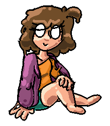

<sub>
If you're viewing this in VSCode, it's recommended that you open it in a preview with `Ctrl+Shift+V`!
</sub>

---

<br>

<center id="start">
  <h2 style="font-size: 42px">
    
    <b>Uranium Template</b> <em>α</em>
  </h2>
  <em style="font-family: 'Comic Sans MS', 'Comic Sans', Impact, Arial">Official manual!!!!</em>
</center>
<br>

**Uranium Template** is a Love2D-inspired NotITG game development template, focusing on keeping things as **Lua-pure** as possible with enough abstractions to make you feel like you're not dealing with Stepmania jank at all.

Uranium Template originally formed during the creation of a currently unreleased project, and since then I've went ahead and refined and polished it up to be usable on its own. Most of the design decisions came from experience using prototype versions of it!

- [Testimonies](#testimonies)
- [Installation](#installation)
- [Distribution](#distribution)
- [How do I start writing code?](#how-do-i-start-writing-code)
- [Defining actors](#defining-actors)
  - [Initializing actors](#initializing-actors)
- [Callback usage](#callback-usage)
  - [Default callbacks](#default-callbacks)
    - [`uranium.update(dt: number)`](#uraniumupdatedt-number)
    - [`uranium.init()`](#uraniuminit)
    - [`uranium.press(direction: string)`](#uraniumpressdirection-string)
    - [`uranium.release(direction: string)`](#uraniumreleasedirection-string)
  - [Custom callbacks](#custom-callbacks)
- [Standard library](#standard-library)
  - [`vector2D`](#vector2d)
    - [`vector2D(x: number | nil, y: number | nil): vector2D`](#vector2dx-number--nil-y-number--nil-vector2d)
    - [`vectorFromAngle(ang: number | nil, amp: number | nil): vector2D`](#vectorfromangleang-number--nil-amp-number--nil-vector2d)
    - [`vector2D:length(): number`](#vector2dlength-number)
    - [`vector2D:lengthSquared(): number`](#vector2dlengthsquared-number)
    - [`vector2D:angle(): number`](#vector2dangle-number)
    - [`vector2D:normalize(): vector2D`](#vector2dnormalize-vector2d)
    - [`vector2D:resize(length: number): vector2D`](#vector2dresizelength-number-vector2d)
    - [`vector2D:unpack(): number, number`](#vector2dunpack-number-number)
    - [`vector2D:distance(vect: vector2D): number`](#vector2ddistancevect-vector2d-number)
    - [`vector2D:distanceSquared(vect: vector2D): number`](#vector2ddistancesquaredvect-vector2d-number)
    - [Operations](#operations)
  - [`color`](#color)
    - [`rgb(r: number, g: number, b: number, a: number | nil): color`](#rgbr-number-g-number-b-number-a-number--nil-color)
    - [`hsl(h: number, s: number, l: number, a: number | nil): color`](#hslh-number-s-number-l-number-a-number--nil-color)
    - [`hsv(h: number, s: number, v: number, a: number | nil): color`](#hsvh-number-s-number-v-number-a-number--nil-color)
    - [`shsv(h: number, s: number, v: number, a: number | nil): color`](#shsvh-number-s-number-v-number-a-number--nil-color)
    - [`hex(hex: string): color`](#hexhex-string-color)
    - [`color:unpack(): number, number, number, number`](#colorunpack-number-number-number-number)
    - [`color:rgb(): number, number, number`](#colorrgb-number-number-number)
    - [`color:hsl(): number, number, number`](#colorhsl-number-number-number)
    - [`color:hsv(): number, number, number`](#colorhsv-number-number-number)
    - [`color:hex(): string`](#colorhex-string)
    - [`color:hue(h: number): color`](#colorhueh-number-color)
    - [`color:huesmooth(h: number): color`](#colorhuesmoothh-number-color)
    - [`color:alpha(a: number): color`](#coloralphaa-number-color)
    - [`color:malpha(a: number): color`](#colormalphaa-number-color)
    - [`color:invert(): color`](#colorinvert-color)
    - [`color:grayscale(): color`](#colorgrayscale-color)
    - [`color:hueshift(a: number): color`](#colorhueshifta-number-color)
    - [Operations](#operations-1)
  - [`input`](#input)
    - [A note about keyboard inputs](#a-note-about-keyboard-inputs)
  - [`bitop`](#bitop)
  - [`rng`](#rng)
    - [`rng.init(seed: number[] | nil): rng`](#rnginitseed-number--nil-rng)
    - [`rng(a: number | nil, b: number | nil): number`](#rnga-number--nil-b-number--nil-number)
    - [`rng:int(min: number, max: number | nil): number`](#rngintmin-number-max-number--nil-number)
    - [`rng:float(max: number | nil): number`](#rngfloatmax-number--nil-number)
    - [`rng:bool(): boolean`](#rngbool-boolean)
    - [`rng:seed(seed: number): void`](#rngseedseed-number-void)
    - [`rng:next(): number`](#rngnext-number)
    - [`rng:jump(): void`](#rngjump-void)
    - [`rng:longJump(): void`](#rnglongjump-void)
  - [`uwuify`](#uwuify)
- [Examples](#examples)
  - [Default Uranium Template code](#default-uranium-template-code)
  - [Simple platformer base](#simple-platformer-base)
- [Credits](#credits)

## Testimonies

- "this template really adds some spice to your modfiles. think industrial glitter in your next chilli!" _- Mayflower_
- "a good template that i have definitely used! jill can i go now. jill please i just want to see my family" _- Aura_

## Installation

Installation is the exact same as any other NotITG template:

1. Unzip your installation zip, as you would a modfile
2. Edit `Song.sm` in your editor of choice (ArrowVortex, NotITG) to include necessary metadata; replace `silence.ogg` with an actual track, if necessary
3. Edit `main.lua` to do whatever you wish to do with it! The entirety of the `src/` folder is yours!
4. _(Recommended)_ Install [sumneko's Lua LSP](https://marketplace.visualstudio.com/items?itemName=sumneko.lua) and grab the latest NotITG typings [here](https://gitlab.com/CraftedCart/notitg_docs/-/archive/master/notitg_docs-master.zip?path=lua) (put them in a folder like `.typings`!)

## Distribution

After you're done with writing your file, be sure to take these steps to reduce the filesize and get your game ready for zipping up!

- Remove `MANUAL.md`, `jillo_png.png`, `docs/`, `.vscode/`, `.gitconfig`, `.gitignore` and `template/typings.lua`. These are files that aren't necessary outside of a development environment!
- Optionally, remove `Song.sm.auto` and `Song.sm.old`. These files may not exist depending on certain factors.
- If you've followed step 4 during [Installation](#installation), be sure to remove your typings folder (likely `.typings`)
- If you're using Git, **PLEASE REMOVE YOUR `.git/` FOLDER!!!**

Afterwards, it should be safe to zip everything up and send it over!

## How do I start writing code?

`main.lua` is the entry-point for your code! From there, you can do the following:

- [Define some actors](#defining-actors), and [call initialization methods on those actors](#initializing-actors) to set them up
- [Define callbacks](#callback-usage), such as the [update](#uraniumupdatedt-number) callback
- Require more files in! Splitting your code into neat little modules is always good practice.
- Make use of the expansive standard library, like the vector or color classes

If you're still a bit clueless, why not check out the [Examples](#examples) section?

## Defining actors

Actors are defined in Uranium Template before any other callback runs, and are defined by a single function of their type:

```lua
local quad = Quad()
local sprite = Sprite('file/location.png')
local text = BitmapText('common', 'hello, world!')
```

### Initializing actors

Once you have an actor defined, you can run whatever methods you want.

> **Note**
> Even though you get a fully functional actor, what you actually get is a _proxied actor_! What this means for you is that you really shouldn't call any getters on the actor, as it'll just return `nil`.

```lua
local text = BitmapText('common', 'hello, world!')
text:xy(scx, scy)
text:zoom(2.3)
text:rotationz(30)
text:diffuse(1, 0.8, 0.8, 1)
```

All methods that you run upon definition will be ran again at the start of every frame:

```lua
local quad = Quad()
quad:xy(scx, scy)
quad:zoomto(60, 60)
quad:diffusealpha(1)

function uranium.update()
  -- doesn't need a reset! it'll automatically zoomto 60, 60 and set its alpha to 1
  quad:Draw()
  quad:zoomto(120, 120)
  quad:diffusealpha(0.5)
  quad:Draw()
end
```

If you want to avoid this, or otherwise call getter methods, use the [`uranium.init`](#uraniuminit) callback:

```lua
local sprite = Sprite()

function uranium.init()
  someTexture = sprite:GetTexture()
end
```

Alternatively, you can also use the actors' individual `InitCommand`s:
```lua
local sprite = Sprite()
sprite:addcommand('Init', function(self)
  someTexture = self:GetTexture()
end)
```

## Callback usage

Uranium uses a unique callback system - to define a callback, you define a function under `uranium.` with your desired callback name:

```lua
function uranium.update(dt)
  -- runs every frame
end
```

You can do this as many times as you like - it'll call every single function that's defined as `uranium.update`, not just the last!

If you return a non-falsy value in a callback, however, it'll cancel every other callback after it. This can be useful for, eg. capturing inputs and ensuring they don't get passed through to other callbacks on accident.

### Default callbacks

These are the callbacks that are built into Uranium:

#### `uranium.update(dt: number)`
Called every frame. `dt` is the time passed since the last frame, the "deltatime".

#### `uranium.init()`
Called once on `OnCommand`. Every actor has been created, and the game should be starting shortly.

#### `uranium.press(direction: string)`
Called when the player presses on a certain key. **Currently only supports arrow keys!!** `direction` can be `Left`, `Down`, `Up` or `Right` (TODO: change this to an enum).

#### `uranium.release(direction: string)`
Same as [`uranium.press`](#uraniumpressdirection-string), except for releasing a key.

### Custom callbacks

Custom callbacks require no extra setup. Define your callback like usual:

```lua
function uranium.somethingHappened(value)
  -- ...
end
```

Then all you need to do to call it is:

```lua
uranium:call('somethingHappened', extra, values, go, here)
```

Callbacks support as many extra values as Lua supports arguments in a function - so let's just say you won't be running out of them any time soon.

## Standard library

The Uranium Template standard library is split up into a few convinient modules. This section aims to comprehensively document them all.

### `vector2D`

`vector2D` is a simple 2D vector class system. For example, to define a vector:
```lua
local vec = vector2D(0, 0)
-- or
local vec = vector(0, 0)
-- or
local vec = vector(0)
-- or
local vec = vector()
```

Then add another vector to it:
```lua
vec = vec + vector(1)
print(vec) --> (1, 1)
```

Then measure its length:
```lua
local len = vec:length()
print(len) --> 1.4142135623730951
           --  (sqrt of 2)
```

Then rotate it and index it:
```lua
vec:rotate(180)

local x = vec.x
-- or
local x = vec[1]

print(x) --> -1
```

#### `vector2D(x: number | nil, y: number | nil): vector2D`

Creates a new vector. If only `x` is passed in, `y` = `x`. If no arguments are passed, `x` = `y` = `0`.

#### `vectorFromAngle(ang: number | nil, amp: number | nil): vector2D`

Creates a new vector pointing in a specific angle. **Specify `ang` in degrees.** `ang` defaults to 0, `amp` defaults to 1.

#### `vector2D:length(): number`

Returns the vector's length. Equal to `vector:distance(vector())`.

#### `vector2D:lengthSquared(): number`

Returns the vector's length, squared. Here mainly for optimization purposes; this is a cheaper version of [`length()`](#vectorlength-number) that's less accurate.

#### `vector2D:angle(): number`

Returns the vector's angle in radians. <!--(TODO: why?)-->

#### `vector2D:normalize(): vector2D`

Normalizes the vector, setting its length to 1 but keeping its angle. Equal to `vector:resize(1)`

#### `vector2D:resize(length: number): vector2D`

Resizes the vector, setting its length but keeping its angle.

#### `vector2D:unpack(): number, number`

Unpacks the vector into its X and Y coordinates. Useful for quickly unpacking it into a function call:
```lua
local quad = Quad()
quad:xy(center:unpack())
```

#### `vector2D:distance(vect: vector2D): number`

Gets the distance between one vector and another.

#### `vector2D:distanceSquared(vect: vector2D): number`

Gets the distance between one vector and another, squared. Here mainly for optimization purposes; this is a cheaper version of [`distance()`](#vectordistancevect-vector-number) that's less accurate.

#### Operations

Here are all valid operations for vectors:

- `vector2D + number`: equal to `vector2D + vector2D(number)`
- `vector2D + vector2D`: adds the vectors' X and Y coordinates together, respectively, forming a new vector
- `vector2D - number`: equal to `vector2D - vector2D(number)`
- `vector2D - vector2D`: subtracts the vectors' X and Y coordinates, respectively, forming a new vector
- `vector2D * number`: equal to `vector2D * vector2D(number)`
- `vector2D * vector2D`: multiplies the vectors' X and Y coordinates together, respectively, forming a new vector
- `vector2D / number`: equal to `vector2D / vector2D(number)`
- `vector2D / vector2D`: divides the vectors' X and Y coordinates, respectively, forming a new vector
- `vector2D == vector2D`: checks if the two vectors' X and Y coordinates are equivalent; returns false with any other type
- `-vector2D`: negates the X and Y coordinates of the vector

### `color`

`color` is a simple wrapper around all things color-related.

#### `rgb(r: number, g: number, b: number, a: number | nil): color`

Constructs a new color using the `r`, `g`, `b` and `a` values. Assumes all values are contained in the set [0, 1]. `a` defaults to 1.

#### `hsl(h: number, s: number, l: number, a: number | nil): color`

Constructs a new color using the `h`, `s`, `l` and `a` values using the [HSL color model](https://en.wikipedia.org/wiki/HSL_and_HSV). Assumes all values are contained in the set [0, 1]. `a` defaults to 1; `h` wraps around.

#### `hsv(h: number, s: number, v: number, a: number | nil): color`

Constructs a new color using the `h`, `s`, `v` and `a` values using the [HSV color model](https://en.wikipedia.org/wiki/HSL_and_HSV). Assumes all values are contained in the set [0, 1]. `a` defaults to 1; `h` wraps around.

#### `shsv(h: number, s: number, v: number, a: number | nil): color`

Equal to [`hsv()`](#hsvh-number-s-number-v-number-a-number--nil), except the hue value is smoothed using cubic smoothing. Not accurate, but produces neater-looking color blends for rainbow-shifting colors.

```lua
local rainbow = shsv(t, 1, 0.5)
```

#### `hex(hex: string): color`

Reads in a hex string and parses it into a `color`. Accepted hex string formats are `#ffffff`, `ffffff`, `#fff` and `fff`.

#### `color:unpack(): number, number, number, number`

Unpacks the color into its R, G, B and A values. Useful for `diffuse`:
```lua
local quad = Quad()
quad:diffuse(col:unpack())
```

#### `color:rgb(): number, number, number`

Returns the color's R, G and B values.

#### `color:hsl(): number, number, number`

Returns the color's H, S and L values in the [HSL color model](https://en.wikipedia.org/wiki/HSL_and_HSV).

#### `color:hsv(): number, number, number`

Returns the color's H, S and V values in the [HSV color model](https://en.wikipedia.org/wiki/HSL_and_HSV).

#### `color:hex(): string`

Returns the color's hex string representation in the format `ffffff`.

#### `color:hue(h: number): color`

Sets the color's hue value in the [HSL/HSV color model](https://en.wikipedia.org/wiki/HSL_and_HSV).

#### `color:huesmooth(h: number): color`

Equivalent to [`color:hue()`](#colorhueh-number-color), except the hue value is smoothed using cubic smoothing. Not accurate, but produces neater-looking color blends for rainbow-shifting colors.

#### `color:alpha(a: number): color`

Sets the color's alpha channel.

#### `color:malpha(a: number): color`

Sets the color's alpha channel, multiplying the previous value with `a`.

#### `color:invert(): color`

Inverts the color.

#### `color:grayscale(): color`

Makes the color grayscale using a more accurate formula than just multiplying every value by `0.5`.

#### `color:hueshift(a: number): color`

Shifts the color's hue by `a`.

#### Operations

Here are all valid operations for colors:

- `color + number`: equal to `color + rgb(number, number, number)`
- `color + color`: adds the colors' R, G and B values together, respectively, forming a new color
- `color - number`: equal to `color - rgb(number, number, number)`
- `color - color`: subtracts the colors' R, G and B values, respectively, forming a new color
- `color * number`: equal to `color * rgb(number, number, number)`
- `color * color`: multiplies the colors' R, G and B values together, respectively, forming a new color
- `color / number`: equal to `color / rgb(number, number, number)`
- `color / color`: divides the colors' R, G and B values, respectively, forming a new color
- `color == color`: checks if the two colors' R, G and B values are equivalent; returns false with any other type

### `input`

`input` is the library that handles everything input-related. Its main feature is providing the `press` and `release` callbacks, but you can also access the raw inputs with the `inputs` table (each value is `-1` if the key is not pressed and the time at which it was pressed, estimated with `t` if it is pressed) and the _raw_ inputs (ignoring callback returns) with `rawInputs`. Additionally, for your convinience, it provides a `directions` enum:
```lua
directions = {
  Left = {-1, 0},
  Down = {0, 1},
  Up = {0, -1},
  Right = {1, 0}
}
```

#### A note about keyboard inputs

Working with left/down/up/right inputs can be tiring at times and it's hard to always fit designs to work with them. However, if you're willing to take a little compromise, you can also _access all keyboard inputs_. However, it's worth noting that this **depends on NotITG's Simply Love** (any forks will work fine too) both for your development environment and for all players. That being said, if you want to access the keyboard API, this is how you do it:

```lua
-- check if the user is using simply love at all
if not stitch then error('This modfile requires the Simply Love theme! https://github.com/TaroNuke/Simply-love-NotITG-ver.-') end

keyboard = stitch('lua.keyboard')

-- table that contains every keyboard key as the key and a boolean as the value
local buffer = keyboard.buffer
-- for example:
local isDebugKeyHeld = buffer['F3']

-- contains booleans for shift, ctrl, alt, win and altgr
local special = keyboard.special
local isDebugKeyAndShiftHeld = isDebugKeyHeld and special.shift
```

### `bitop`

A Lua 5.0 port of [bitop-lua](https://github.com/AlberTajuelo/bitop-lua). See their repository for documentation.

### `rng`

A xoshiro128** reimplementation in Lua.

#### `rng.init(seed: number[] | nil): rng`

Initializes a new RNG class. `seed` must be a table of size 4; if it is not provided, `os.time()` is used in its place. _(Not `os.clock()`!!! Two RNG values created at the same time with no provided seed will be the same.)_

#### `rng(a: number | nil, b: number | nil): number`

Acts identical to `math.random()`. Pass in no arguments to get a random float from 0 to 1, pass in one argument to get a random inclusive integer from 1 to `a`, pass in two arguments to get a random integer from `a` to `b`.

#### `rng:int(min: number, max: number | nil): number`

Generates an inclusive random integer. Pass in one argument to get a random integer from 1 to `a`, pass in two arguments to get a random integer from `a` to `b`.

#### `rng:float(max: number | nil): number`

Generates a random fractional number from `0` to `max`. `max` defaults to 1.

#### `rng:bool(): boolean`

Generates either a `true` or a `false` randomly.

#### `rng:seed(seed: number): void`

Sets the seed and advances the state.

#### `rng:next(): number`

Gets the next pseudo-random value. Recommended to use [`int`](#rngintmin-number-max-number-number), [`float`](#rngfloatmax-number--nil-number), etc. over this.

#### `rng:jump(): void`

The jump function:

> This is the jump function for the generator. It is equivalent
> to 2^64 calls to next(); it can be used to generate 2^64
> non-overlapping subsequences for parallel computations.

#### `rng:longJump(): void`

The long-jump function:

> This is the long-jump function for the generator. It is equivalent to
> 2^96 calls to next(); it can be used to generate 2^32 starting points,
> from each of which jump() will generate 2^32 non-overlapping
> subsequences for parallel distributed computations.

### `uwuify`

```lua
print(uwuify('hello, world!')) --> hewwo, wowwd!
```

_A very important library I don't see enough game engines include in their standard libraries._

## Examples

Here are a couple of examples. All of these are standalone `main.lua` files that you can plug in and view the results of!

### Default Uranium Template code
```lua
-- define a basic quad
local quad = Quad()
quad:xy(scx, scy)
quad:zoom(120)
quad:diffuse(0.8, 1, 0.7, 1)
quad:skewx(0.2)

-- define a sprite
local sprite = Sprite('../docs/uranium.png')
sprite:xy(scx, scy)
sprite:zoom(0.4)
sprite:glow(1, 1, 1, 0)

-- let's add some text aswell
local text = BitmapText('common', 'hello, uranium template!')
text:xy(scx, scy + 100)

-- update gets called every frame
-- dt here refers to deltatime - the time that has passed since the last frame!
function uranium.update(dt)
  -- let's rotate our quad
  quad:rotationz(t * 80)
  -- then shove it to the screen - similar to a drawfunction!
  quad:Draw()
  -- and you can do this multiple times of course!
  quad:zoomto(180, 180)
  quad:rotationz(t * 100)
  quad:diffusealpha(0.4)
  quad:skewx(0.1)
  quad:Draw()
  -- no need to reset properties - uranium resets all properties that you set upon definition!

  -- throw in the logo aswell, because why not
  -- zoom and glow is done for a quick-and-dirty outline
  sprite:zoom(sprite:GetZoom() * 1.1)
  sprite:glow(1, 1, 1, 1)
  sprite:Draw()
  -- if you can't wait until the start of a frame to reset properties, you can manually do it
  reset(sprite)
  sprite:Draw()

  -- for the text, get a rainbow color
  local col = shsv(t * 0.6, 0.5, 1)
  print(col)
  text:diffuse(col:unpack()) -- the :unpack() is necessary when passing into :diffuse()
  -- wag the text
  text:rotationz(math.sin(t * 2) * 10)
  text:Draw()
end
```

### Simple platformer base
```lua
-- constants are just those that felt nice to me. this is completely valid to do in gamedev
local DAMPING = 1/9500
local SPEED = 2
local JUMP_FORCE = 32
local GRAVITY = 2.3
local PLAYER_SIZE = 50

local groundY = sh * 0.8

local protagActor = Quad()
protagActor:zoomto(PLAYER_SIZE, PLAYER_SIZE)
local ground = Quad()
ground:zoomto(sw, 4)
ground:xy(scx, groundY + PLAYER_SIZE/2 + 4/2)

local pos = vector(scx, groundY)
local vel = vector(0, 0)
local hasHitGround = true -- let's define this so that you can't jump mid-air

-- called whenever the player recieves an input
function uranium.press(direction)
  if direction == 'Up' and hasHitGround then
    vel.y = vel.y - JUMP_FORCE
    hasHitGround = false
    return true -- input eaten! further callbacks won't recieve this
  end
end

function uranium.update(dt)
  -- respond to l/r inputs
  if inputs.Left ~= -1 then
    vel.x = vel.x - SPEED
  end
  if inputs.Right ~= -1 then
    vel.x = vel.x + SPEED
  end

  -- apply gravity
  vel.y = vel.y + GRAVITY

  -- update position, apply damping to velocity
  pos = pos + vel
  vel = vel * math.pow(DAMPING, dt)

  -- make sure the player can't clip through the ground
  if pos.y >= groundY then
    pos.y = groundY
    if vel.y >= 0 then vel.y = 0 end
    hasHitGround = true
  end

  -- make sure the player can't leave the screen on accident
  pos.x = math.min(pos.x, sw - PLAYER_SIZE/2)
  pos.x = math.max(pos.x, 0  + PLAYER_SIZE/2)

  -- draw them!
  protagActor:xy(pos.x, pos.y)
  protagActor:Draw()

  -- draw the ground
  ground:Draw()
end
```

## Credits

**XeroOl** - Mirin Template was a massive design inspiration; early stages of this template borrowed lots of code from it<br>
**Mayflower**, **Aura** - Testing, design help<br>
**mangoafterdawn** - The Uranium Template logo!<br>

<br><br><br>
<center>
  
</center>