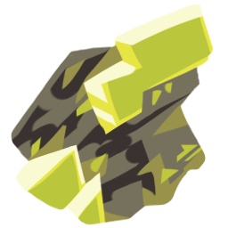

<sub> If you're viewing this in VSCode, it's recommended that you open it in a
preview with `Ctrl+Shift+V`! </sub>

<br>

<center>
  <h2 style="font-size: 42px">
    
    <b>Uranium Template</b>
  </h2>
  <em style="font-family: 'Comic Sans MS', 'Comic Sans', Impact, Arial">Official manual!!!! (Now for v2!!!!)</em>
</center>
<br>

**Uranium Template** is a low-level generic template for NotITG v4.9+. In
particular, it's specialized towards non-modfile development, including
minigames, file selectors, and other meta projects.

The design is pretty closely based off of the design of code-only engines like
Love2D, and the goal is to provide a solid base to develop anything with a
similar philosophy on top.

Uranium Template originally formed during the creation of a currently unreleased
project, and v2 formed during the creation of the [Mod Jam Kusoge lobby](https://www.youtube.com/watch?v=CSJ_pimhrYA).
Since then I've refined and polished it up to be usable on its own. Most of the
design decisions came from experience using prototype versions of it!

<b style="font-size: 42px">TODO this is super unupdated for v2</b>

- [Installation](#installation)
- [Distribution](#distribution)
- [How do I start writing code?](#how-do-i-start-writing-code)
- [Defining actors](#defining-actors)
  - [Initializing actors](#initializing-actors)
  - [Accessing raw actors](#accessing-raw-actors)
  - [Actor-specific notes](#actor-specific-notes)
    - [`ActorFrameTexture`](#actorframetexture)
    - [`ActorFrame`](#actorframe)
    - [`ActorScroller`](#actorscroller)
    - [`BitmapText`](#bitmaptext)
    - [Textures](#textures)
  - [Shaders](#shaders)
- [Callback usage](#callback-usage)
  - [Default callbacks](#default-callbacks)
    - [`update(dt: number)`](#updatedt-number)
    - [`init()`](#init)
    - [`ready()`](#ready)
    - [`exit()`](#exit)
    - [`focus(hasFocus: boolean)`](#focushasfocus-boolean)
  - [Custom callbacks](#custom-callbacks)
- [Requiring files](#requiring-files)
- [Configuration](#configuration)
    - [`uranium.config.resetOnFrameStart(bool: boolean)`](#uraniumconfigresetonframestartbool-boolean)
    - [`uranium.config.resetActorOnFrameStart(actor: Actor, bool: boolean?)`](#uraniumconfigresetactoronframestartactor-actor-bool-boolean)
    - [`uranium.config.hideThemeActors(bool: boolean)`](#uraniumconfighidethemeactorsbool-boolean)
- [Standard library](#standard-library)
  - [Importing modules](#importing-modules)
  - [`vector2D`](#vector2d)
    - [`vector2D(x: number | nil, y: number | nil): vector2D`](#vector2dx-number--nil-y-number--nil-vector2d)
    - [`vectorFromAngle(ang: number | nil, amp: number | nil): vector2D`](#vectorfromangleang-number--nil-amp-number--nil-vector2d)
    - [`vector2D:length(): number`](#vector2dlength-number)
    - [`vector2D:lengthSquared(): number`](#vector2dlengthsquared-number)
    - [`vector2D:angle(): number`](#vector2dangle-number)
    - [`vector2D:rotate(ang: number): vector2D`](#vector2drotateang-number-vector2d)
    - [`vector2D:normalize(): vector2D`](#vector2dnormalize-vector2d)
    - [`vector2D:resize(length: number): vector2D`](#vector2dresizelength-number-vector2d)
    - [`vector2D:unpack(): number, number`](#vector2dunpack-number-number)
    - [`vector2D:distance(vect: vector2D): number`](#vector2ddistancevect-vector2d-number)
    - [`vector2D:distanceSquared(vect: vector2D): number`](#vector2ddistancesquaredvect-vector2d-number)
    - [Operations](#operations)
  - [`color`](#color)
    - [`rgb(r: number, g: number, b: number, a: number | nil): color`](#rgbr-number-g-number-b-number-a-number--nil-color)
    - [`hsl(h: number, s: number, l: number, a: number | nil): color`](#hslh-number-s-number-l-number-a-number--nil-color)
    - [`hsv(h: number, s: number, v: number, a: number | nil): color`](#hsvh-number-s-number-v-number-a-number--nil-color)
    - [`shsv(h: number, s: number, v: number, a: number | nil): color`](#shsvh-number-s-number-v-number-a-number--nil-color)
    - [`hex(hex: string): color`](#hexhex-string-color)
    - [`color:unpack(): number, number, number, number`](#colorunpack-number-number-number-number)
    - [`color:rgb(): number, number, number`](#colorrgb-number-number-number)
    - [`color:hsl(): number, number, number`](#colorhsl-number-number-number)
    - [`color:hsv(): number, number, number`](#colorhsv-number-number-number)
    - [`color:hex(): string`](#colorhex-string)
    - [`color:hue(h: number): color`](#colorhueh-number-color)
    - [`color:huesmooth(h: number): color`](#colorhuesmoothh-number-color)
    - [`color:alpha(a: number): color`](#coloralphaa-number-color)
    - [`color:malpha(a: number): color`](#colormalphaa-number-color)
    - [`color:invert(): color`](#colorinvert-color)
    - [`color:grayscale(): color`](#colorgrayscale-color)
    - [`color:hueshift(a: number): color`](#colorhueshifta-number-color)
    - [Operations](#operations-1)
  - [`easable`](#easable)
    - [`easable(default: number): easable`](#easabledefault-number-easable)
    - [`easable:set(new: number): void`](#easablesetnew-number-void)
    - [`easable:add(new: number): void`](#easableaddnew-number-void)
    - [`easable:reset(new: number): void`](#easableresetnew-number-void)
    - [Operations](#operations-2)
  - [`input`](#input)
    - [`input.inputType`](#inputinputtype)
    - [`input.directions`](#inputdirections)
    - [`input.getInputName(i: inputType): string`](#inputgetinputnamei-inputtype-string)
    - [`input.keyboardEquivalent`](#inputkeyboardequivalent)
    - [`input.getInput(i: string, pn: number | nil): number`](#inputgetinputi-string-pn-number--nil-number)
    - [`input.isDown(i: string, pn: number | nil): number`](#inputisdowni-string-pn-number--nil-number)
    - [`press(input: inputType, pn: number)`](#pressinput-inputtype-pn-number)
    - [`release(input: inputType, pn: number)`](#releaseinput-inputtype-pn-number)
    - [A note about keyboard inputs](#a-note-about-keyboard-inputs)
  - [`bitop`](#bitop)
  - [`scheduler`](#scheduler)
    - [`scheduler.schedule(when: number, func: function): number`](#schedulerschedulewhen-number-func-function-number)
    - [`scheduler.scheduleInTicks(when: number, func: function): number`](#schedulerscheduleintickswhen-number-func-function-number)
    - [`scheduler.unschedule(i: index): void`](#schedulerunschedulei-index-void)
    - [`scheduler.unscheduleInTicks(i: index): void`](#schedulerunscheduleinticksi-index-void)
  - [`binser`](#binser)
  - [`mirin`](#mirin)
    - [A note about `reset`](#a-note-about-reset)
  - [`savedata`](#savedata)
    - [`savedata.initializeModule(name: string, forceIgnore: boolean): void`](#savedatainitializemodulename-string-forceignore-boolean-void)
      - [Generating a savedata name](#generating-a-savedata-name)
    - [`savedata.s(data: table, name: string | nil): void`](#savedatasdata-table-name-string--nil-void)
    - [`savedata.save(instant: boolean): void`](#savedatasaveinstant-boolean-void)
    - [`savedata.load(): void`](#savedataload-void)
    - [`savedata.getLastSave(): string[] | nil`](#savedatagetlastsave-string--nil)
    - [`savedata.enableAutosave(): void`](#savedataenableautosave-void)
  - [`env`](#env)
    - [`env.inEditor: boolean`](#envineditor-boolean)
    - [`env.onWine: boolean`](#envonwine-boolean)
  - [`rng`](#rng)
    - [`rng.init(seed: number[] | nil): rng`](#rnginitseed-number--nil-rng)
    - [`rng(a: number | nil, b: number | nil): number`](#rnga-number--nil-b-number--nil-number)
    - [`rng:int(min: number, max: number | nil): number`](#rngintmin-number-max-number--nil-number)
    - [`rng:float(max: number | nil): number`](#rngfloatmax-number--nil-number)
    - [`rng:bool(): boolean`](#rngbool-boolean)
    - [`rng:seed(seed: number): void`](#rngseedseed-number-void)
    - [`rng:next(): number`](#rngnext-number)
    - [`rng:jump(): void`](#rngjump-void)
    - [`rng:longJump(): void`](#rnglongjump-void)
  - [`ease`](#ease)
  - [`players`](#players)
  - [`profiler`](#profiler)
  - [`util`](#util)
  - [`aft`](#aft)
  - [`noautoplay`](#noautoplay)
  - [`eternalfile`](#eternalfile)
  - [`uwuify`](#uwuify)
- [Examples](#examples)
  - [The obligatory](#the-obligatory)
  - [Default Uranium Template code](#default-uranium-template-code)
  - [Simple platformer base](#simple-platformer-base)
  - [AFTs](#afts)
  - [Shader test](#shader-test)
  - [Savedata example](#savedata-example)
  - [Simple ActorFrame setup](#simple-actorframe-setup)
- [Credits](#credits)

## Installation

Installation is the exact same as any other NotITG template:

0. Get the latest template version from [the Gitea releases page](https://git.oat.zone/oat/uranium-template/releases)
1. Unzip your installation zip, as you would a modfile
2. Edit `Song.sm` in your editor of choice (ArrowVortex, NotITG, Notepad, ...)
to include necessary metadata; replace `silence.ogg` with an actual track, if
necessary
3. Edit `main.lua` to do whatever you wish to do with it! The entirety of the
`src/` folder is yours!
4. _(Recommended)_ Install [LuaLS](https://luals.github.io/#install)
([VSCode](https://marketplace.visualstudio.com/items?itemName=sumneko.lua),
[JetBrains IDEs](https://plugins.jetbrains.com/plugin/22315-sumnekolua)) and
grab the latest NotITG typings from
[here](https://gitlab.com/CraftedCart/notitg_docs/-/archive/master/notitg_docs-master.zip?path=lua)
(put them in a folder like `.typings`!). Uranium comes with typings for its own
libraries and modules, which work best when NotITG typings are also available to
the language server.

## Distribution

After you're done with writing your file, be sure to take these steps to reduce
the filesize and get your file ready for zipping up!

- Remove `distribute-file.sh`, `MANUAL.md`, `docs/`, `.vscode/`, `.gitconfig`
and `.gitignore`. These are files that aren't necessary outside of a development environment!
- Remove `Song.sm.auto` and `Song.sm.old` if your chart editor left
them over from an earlier edit.
- If you've added NotITG typings during installation, be sure to remove your 
typings folder (likely `.typings`)
- If you're using Git, **PLEASE REMOVE YOUR `.git/` FOLDER!!!**

If you're on Linux or have MSYS2/WSL/similar installed, you can use the
[distribution script](distribute-file.sh).

Afterwards, it should be safe to zip everything up and send it over!

## How do I start writing code?

`src/main.lua` is the entry-point for your code! From there, you can do anything
you'd like to do with the modfile.

If you're still a bit clueless, why not check out the [Examples](#examples)
section?

## Requiring files

`require` in Uranium works a lot like Lua's vanilla `require`, and is a direct
copy of Mirin's `require`.

Say you have a file structure like this:

`src/main.lua`
```lua
local value = require 'test'
print(value)
```

`src/test.lua`
```lua
return 'hello!'
```

Your setup would print `'hello!'`.

### Namespaces

Uranium has two default defined namespaces: `uranium` and `stdlib`. `uranium`
holds interfaces to and from the template; this is what you'll pull in to define
actors, listen to default events, and configure the template. `stdlib` is the
Uranium standard library, holding various optional libraries you can pull in for
personal ease of use.

### `package` module

Uranium also includes a `package` module as a global. It implements a subset of
the methods/fields that Lua's default `package` module provides. It provides one
extra field, `base`, which is a shorthand for
`GAMESTATE:GetCurrentSong():GetSongDir()`.

## Defining actors

Actors are defined in Uranium Template before any other callback runs, and are
defined by functions under a `Context`:

```lua
local uranium = require 'uranium'
local ctx = uranium.ctx

local quad = ctx:Quad()
local sprite = ctx:Sprite('file/location.png')
local text = ctx:BitmapText('common', 'hello, world!')
```

For convenience purposes, you may define `ctx` as a global to avoid redefining
it in every newly required module. Every example from here on out will assume
`ctx` is defined as such:

```lua
ctx = require('uranium').ctx
```

Defining actors during runtime (after `init`) is forbidden and will return in
an error:

```lua
events:on('init', function()
  local quad = ctx:Quad() -- actor235: attempting to modify actor queue while it is locked. did you call 'lock' too early?
end)
```

All actors that take in filenames have their filenames starting from the root of
the project; meaning if you had a file in `Songs/Modfile/src/test.png`, you'd
have to pass in a filename of `src/test.png`. **If an image is blank, or a
single pink pixel, it hasn't loaded properly.**

### Initializing actors

Once you have an actor defined, you can run whatever methods you want to set
initial values.

```lua
local text = ctx:BitmapText('common', 'hello, world!')
text:xy(scx, scy)
text:zoom(2.3)
text:rotationz(30)
text:diffuse(1, 0.8, 0.8, 1)
```

These will come into effect as soon as the actor is initialized; think of it as
an `InitCommand`.

### A note on proxies

Even though what you may think you get a fully functional actor, what you
actually get is a _proxied actor_ (not to be confused with NotITG's
`ActorProxy`). Due to a quirk of NotITG, unlike what Uranium's initialization
wrapping would have you believe, there is no method for creating actors during
runtime. Instead, when a method under `ctx` is called, that actor is committed
to the _actor queue_ that's then used after loading your `main.lua` to construct
the actor tree.

What this means in practice is that the actors you get will not be real actors,
but rather proxies:

```lua
local quad = ctx:Quad()
print(quad) --> Proxy of Quad (unresolved)
```

The `(unresolved)` in this means that the real actor this proxy stands in for
has yet to be created, so any getter calls for it will dummy out and return
`nil`:

```lua
print(quad:GetX()) --> nil
```

However, after the `init` event, it will be filled in with its awaited actor:

```lua
events:on('init', function()
  print(quad) --> Proxy of Sprite (0D42AC40)
  print(quad:GetX()) --> 0
end)
```

For convenience, defining an `InitCommand` with `addcommand` will also have the
same behavior:

```lua
quad:addcommand('Init', function()
  print(quad) --> Proxy of Sprite (0D42AC40)
end)
```

As a consequence of Uranium actors being proxies and not native NotITG actors,
you cannot pass them into native NotITG calls without first stripping the proxy.
This can be done by requiring the `Proxy` class from `uranium.actors.proxy`:

```lua
local Proxy = require 'uranium.actors.proxy'

local sprite = ctx:Sprite('src/assets/she.png')
local sine = ctx:Shader('src/glsl/sine.frag')

events:on('init', function()
  sprite:SetShader(Proxy.getRaw(sine))
end)
```

This should mainly be necessary only with the `Shader` and `Texture`
initializers, however, as all other actors never really need to be passed into
other functions.

Not doing so will result in warnings, AVs or silent failures. For instance, with
shaders, the following line is printed in the log, and the shader does not
apply:

```
WARNING: LunaActor::SetShader(): The given shader is null!
```

#### Miscellaneous proxy notes

The `Proxy` class mentioned above holds a few other more obscure utilities for
working with proxied actors:

- You can check if an actor is a native NotITG class or a proxied actor with
`isProxy`:

  ```lua
  local quad = ctx:Quad()
  Proxy.isProxy(quad) --> true
  Proxy.isProxy(SCREENMAN:GetTopScreen()) --> false
  ```
- If you want to store data on a `Proxy`, you can make use of Uranium's internal
data store:

  ```lua
  Proxy.setData(quad, 'foo', 'bar')
  Proxy.getData(quad, 'foo') --> 'bar'
  ```

  Do note that Uranium will also use this store for certain behavior, which will
use the same context as your own data.

### Actor-specific notes

#### `ActorFrameTexture`

AFTs in Uranium work in the same way as usual AFTs: they capture everything that
was drawn to the screen before them. However, this also translates quite
directly to the recommended DrawFunction workflow:

```lua
quad:Draw() -- will be drawn to the AFT

aft:Draw()

sprite:Draw() -- will not be drawn to the AFT
```

In this case, the definition order of the actor does not matter, and you can
dynamically swap the `Draw` call order as you wish.

See [the AFT example](#afts) for a quick setup to play around with, or the
example in the [`aft` library](#aft) for a barebones setup.

#### `ActorFrame`

To create an `ActorFrame`, first define it as a regular actor, then create a
_sub-context_ from it:

TODO move context to its own module

```lua
local Context = require('uranium.actors').Context

local af = ctx:ActorFrame()
local subCtx = Context.getContext(af)
```

Any actors created under that sub-context will be nested into the ActorFrame:

```lua
local quad = subCtx:Quad()

local subAf = subCtx:ActorFrame()
local subSubCtx = Context.getContext(subAf)
local deeplyNestedQuad = subSubCtx:Quad()
```

#### `ActorScroller`

`ActorScroller`s are current unsupported. I don't know if they ever will be.

#### `BitmapText`

TODO fix and document absolute/relative font paths

### Textures

For convinience, `Texture` is a function that will give you a `RageTexture` from
a filename without the actor. Equivalent to:

```lua
local sprite = ctx:Sprite('filename.png')
sprite:hidden(1)
local texture = sprite:GetTexture()
return texture
```

### Shaders

In Uranium, shaders are defined entirely seperately from actors, and then
assigned onto the actors afterwards.

```lua
local sprite = ctx:Sprite('src/assets/she.png')
local sine = ctx:Shader('src/glsl/sine.frag')

events:on('init', function()
  sprite:SetShader(Proxy.getRaw(sine))
end)
```

Defining vertex shaders is done the same way, except with the second argument
instead:

```lua
local shader = ctx:Shader('src/shader.frag', 'src/shader.vert')
```

To define a vertex shader and nothing else, you'll need to omit the fragment
shader and put a `nil` in its place:

```lua
local shader = ctx:Shader(nil, 'src/shader.vert')
```

If you prefer, you can also inline shader code, as long as you don't mix files
with inlined code in the same shader set:

```lua
local shader = ctx:Shader([[
  #version 120

  void main() {
    gl_FragColor = vec4(0.420, 0.69, 1.0, 1.0);
  }
]])
```

And last, if you want a no-op shader, you can just do a simple argumentless
call:

```lua
local noopShader = ctx:Shader()
```

Check [the shader example](#shader-test) if you just want something to play
around with.

## Callback usage

Callbacks are defined with the `uranium.events` module:

```lua
local events = require 'uranium.events'

events:on('update', function()
  -- updates every frame
end)
```

Callbacks are ran in order of definition. Because this is rather finnicky, in
situations where you're expected to pay attention to execution order of even
callbacks, it's recommended to build your own execution order on top of a single
callback:

```lua
events:on('update', function()
  if isMenuOpen() return end
  runPreUpdate()
  runUpdate()
  runPostUpdate()
end)
```

If you return a value in a callback, it'll cancel every other callback after it.
This can be useful for, eg. capturing inputs and ensuring they don't get passed
through to other callbacks on accident. The value will then be returned to the
callback caller.

### Default callbacks

These are the callbacks that are built into Uranium:

#### `update(dt: number)`
Called every frame. `dt` is the time passed since the last frame, the
"deltatime".

#### `init()`
Called once on `OnCommand`. Every actor has been created, and the game should be
starting shortly.

#### `ready()`
Fired on the first tick. A later version of `init()` where more things should be
safe to use; for instance, players are safe to be referenced here.

#### `exit()`
_Should_ call when the player exits the file. **This is an incredibly
inconsistent and hacky event**, and you should never be relying on it.

#### `focus(hasFocus: boolean)`
Called whenever the window loses/gains focus. Convenient event shim for the
`WindowFocus` and `WindowFocusLost` commmands.

### Custom callbacks

Custom callbacks require no extra setup. Define your callback like usual:

```lua
events:on('somethingHappened', function(value)
  -- ...
end)
```

Then all you need to do to call it is:

```lua
events:call('somethingHappened', value)
```

Callbacks support variable arguments, so you can put in as many arguments in as
you like.

### Advanced usage

Uranium's event system uses the [`EventHandler`](#eventhandler) class, which you
can check the documentation of for further usage notes.

## Configuration

Uranium Template's base functionality can be configured using `uranium.config`:

```lua
local config = require 'uranium.config'
config.hideThemeActors = false
```

#### `hideThemeActors: boolean`

Toggle if theme actors (lifebars, scores, song names, etc.) are hidden. Must be
toggled **before** `init`. _(Default: `true`)_

## Standard library

The Uranium Template standard library is split up into several modules. This
section aims to comprehensively document them all.

> [!NOTE]
> Several of Uranium's default modules have disappeared since v2. The
> reason being that maintaining them in Uranium felt rather pointless, and I'd
> rather users make the choice for most of those libraries anyways.
>
> They can still be found in [my personal Lua module
> repo](https://github.com/oatmealine/jadelib), although with less
> documentation and support.

TODO update with v2 modules

### `input`

TODO update with v2 and finalize changes

`input` is the library that handles everything input-related. Its main feature is providing the `press` and `release` callbacks, but you can also access the raw inputs with the `inputs` table (each value is `-1` if the key is not pressed and the time at which it was pressed, estimated with `t` if it is pressed) and the _raw_ inputs (ignoring callback returns) with `rawInputs`.

#### `input.inputType`

The `input` module can detect every input that the game can pass through the [`StepP<player><input><action>MessageCommand`](https://craftedcart.gitlab.io/notitg_docs/message_commands.html#stepp-player-input-action-messagecommand). This list is:
```
MenuLeft
MenuRight
MenuUp
MenuDown
Start
Select
Back
Coin
Operator
Left
Right
Up
Down
UpLeft
UpRight
ActionLeft
ActionRight
ActionUp
ActionDown
Action1
Action2
Action3
Action4
Action5
Action6
Action7
Action8
MenuStart
```

All of these inputs are neatly stored away in an enum called `inputType`. For instance, if you wanted to check if an input was `Start`, you would do:

```lua
local isStart = i == input.inputType.Start
```

#### `input.directions`

For your convinience, cardinal inputs are given a simple directions enum:
```lua
self.directions = {
  [self.inputType.Left] = {-1, 0},
  [self.inputType.Down] = {0, 1},
  [self.inputType.Up] = {0, -1},
  [self.inputType.Right] = {1, 0}
}
```

#### `input.getInputName(i: inputType): string`

Gets the name of an input. The reverse of indexing the `inputType` enum.

#### `input.keyboardEquivalent`

Mappings for the default keybinds for most keys. It's recommended to put them alongside the in-game representation in UIs to avoid confusion:

```lua
local inputName = input.getInputName(i)
local keyboardInput = input.keyboardEquivalent[i]
if keyboardInput then
  inputName = inputName .. ' (defaults to ' .. keyboardInput .. ')'
end
local dialog = 'Press ' .. inputName .. ' to boop' --> 'Press Start (defaults to Enter) to boop'
```

#### `input.getInput(i: string, pn: number | nil): number`

Shorthand for accessing `input.inputs` directly. If `pn` is not provided, it gets either of the players' inputs, prioritizing any that are held down.
```lua
input.inputs[1][input.inputType.Left] == input.getInput('Left', 1)
```

#### `input.isDown(i: string, pn: number | nil): number`

Shorthand for `input.getInput(i, pn) ~= -1`. If `pn` is not provided, players are ignored and it checks if either of the players have the input held down

#### `press(input: inputType, pn: number)`
Called when a player presses on a certain key.

#### `release(input: inputType, pn: number)`
Same as [`press`](#pressinput-inputtype), except for releasing a key.

#### A note about keyboard inputs

Working with left/down/up/right inputs can be tiring at times and it's hard to always fit designs to work with them. However, if you're willing to take a little compromise, you can also _access all keyboard inputs_. However, it's worth noting that this **depends on NotITG's Simply Love** (any forks will work fine too) both for your development environment and for all players. That being said, if you want to access the keyboard API, this is how you do it:

```lua
-- check if the user is using simply love at all
if not stitch then error('This modfile requires the Simply Love theme! https://github.com/TaroNuke/Simply-love-NotITG-ver.-') end

keyboard = stitch('lua.keyboard')

-- table that contains every keyboard key as the key and a boolean as the value
local buffer = keyboard.buffer
-- for example:
local isDebugKeyHeld = buffer['F3']

-- contains booleans for shift, ctrl, alt, win and altgr
local special = keyboard.special
local isDebugKeyAndShiftHeld = isDebugKeyHeld and special.shift
```

### `scheduler`

TODO update with v2 changes
also maybe switch this to another scheduler

A simple scheduler.

```lua
local scheduler = require('stdlib.scheduler')
```

#### `scheduler.schedule(when: number, func: function): number`

Schedules a function to run in a specific amount of time. `when` is in seconds.

#### `scheduler.scheduleInTicks(when: number, func: function): number`

Schedules a function to run in a specific amount of `update` calls/ticks.

#### `scheduler.unschedule(i: index): void`

Unschedules a function. Use the index returned to you when originally scheduling the function.

#### `scheduler.unscheduleInTicks(i: index): void`

Unschedules a function in ticks. Use the index returned to you when originally scheduling the function.

### `binser`

A NotITG Lua port of [binser](https://github.com/bakpakin/binser). Used for
[savedata](#savedata) serialization.

### `mirin`

_Exports globals_

A copy of the [Mirin Template by
XeroOl](https://github.com/XeroOl/notitg-mirin/) (currently at 5.0.1), shoved in
and ported for your convinience. Works exactly the same as regular Mirin.

### `savedata`

TODO update with and finalize v2 changes

_Defines callbacks_

A complete library for saving and loading arbitrary data to the user's profile.
Uses [binser](#binser) for serialization. See [Savedata
example](#savedata-example) for an example of how to use this library.

#### `savedata.initializeModule(name: string, forceIgnore: boolean): void`

Initializes the savedata module. `forceIgnore` makes the function ignore name checks, **but please don't use it unless you know what you're doing!!!**

##### Generating a savedata name

Ideally, you'd generate a savedata name by [generating a random 16-character
string](https://www.random.org/strings/?num=1&len=16&digits=on&upperalpha=on&loweralpha=on&unique=on&format=plain&rnd=new)
and appending it to your game's name. For instance:

```lua
savedata.initializeModule('myGameName_doAmaUOBIjiaSWyz')
```

The reason this is done is to avoid name collision - all modfiles share a global
profile namespace to put their saved data in. To prevent it as much as possible,
I've decided to force the user to generate a unique name that _most likely_
won't be taken by anything else. `forceIgnore` completely ignores the
16-character and special/normal character checks.

#### `savedata.s(data: table, name: string | nil): void`

Creates a new module in your savedata. It uses `data` for defaults, then uses it
for writing savedata to it and reading savedata from it; for instance, this
would be correct usage:

```lua
local counter = {
  n = 0
}

savedata.s(counter)

uranium.on('init', function()
  print(counter.n) --> could be different from 0!
end)

uranium.on('update', function()
  counter.n = counter.n + 1 -- this will be saved the next time savedata.save is called
end)
```

By default, the name that's used for your module will be the folder your Lua
file is located in, followed by its filename. **This means you should not rely
on the automatic name generation if your Lua file rests at the root of your file
or if you're calling this function via `loadstring` or similar** as it will
create unpredictable module names that will change between setups and sometimes
even game restarts. You can pass in any string you like to `name`, as long as
it's unique in your project, to override this behavior.

#### `savedata.save(instant: boolean): void`

Saves the savedata onto the user's profile. It waits a single tick to do so and
sets the boolean `saveNextFrame` to `true`; this is so that your game can
display a loading frame for the temporary lagspike, as chances are, on lower-end
setups with hard drives, this will momentarily freeze the game as it writes the
profile. You can make it instantly save with `instant`.

#### `savedata.load(): void`

Loads the savedata. _Shouldn't be called manually; this is automatically called
on [`init()`](#init)._

#### `savedata.getLastSave(): string[] | nil`

Gets the last save time that persists between game restarts in the format
`{hour, minute, date, month, year}`. If the game has not saved once, returns
`nil`.

#### `savedata.enableAutosave(): void`

Enables autosave via [`exit()`](#exit). Should hopefully mean data should never
get lost.

### `env`

Small module that contains a bit of information about the user's environment.

#### `env.inEditor: boolean`

Is `true` if the file is being played in the editor. Useful for debugging stuff.

#### `env.onWine: boolean`

Is `true` if the player is playing NotITG through Wine or similar.

### `ease`

_Exports globals_

A direct copy of [Mirin Template's
`ease.lua`](https://github.com/XeroOl/notitg-mirin/blob/master/template/ease.lua),
for convinience. See the docs for those
[**here**](https://xerool.github.io/notitg-mirin/docs/eases.html).

### `players`

TODO update with and finalize v2 changes
also say this shouldn't go outside `ready`

_Exports globals_

Pulls in the players as `P[1-8]` and `P<1-8>`.

```lua
require('stdlib.players')
P1:hidden(1)
P2:hidden(1)
```

### `util`

TODO murder kill

_Exports globals_

A big ol' module that holds a bunch of useful functions. These were too specific
or too niche to go in any singular module; so they're all here now.

There's _a bit too many_ functions to document, so I'd recommend just looking
through the source code. I promise it doesn't bite.

### `aft`

TODO update with and finalize v2 changes

An AFT setup library. Sets up sprites and AFTs with `sprite` and `aft`, or
all-in-one with `aftSetup`, making them ready for texturing use.

```lua
local aftlib = require('stdlib.aft')

-- aftSprite is a Sprite, set to the texture of aft, an ActorFrameTexture
local aft, aftSprite = aftlib.aftSetup()
```

### `eternalfile`

TODO rec to put this in `ready`

A single function which turns your file into an eternal, neverending file, until
the player puts it out of its misery by exiting. The current beat will always go
from 0 to 1 and start over once this is enabled. This also sets the notedata to
nothing to avoid hitting padding mines.

```lua
require('stdlib.eternalfile')()
```

## Examples

TODO update with v2 changes

Here are a couple of examples. All of these are standalone `main.lua` files that you can plug in and view the results of!

### The obligatory
```lua
local text = BitmapText('common', 'Hello, world!')
text:xy(scx, scy)

uranium.on('update', function()
  text:Draw()
end)
```

### Simple platformer base
```lua
require('stdlib.vector2D')
local input = require('stdlib.input')

-- constants are just those that felt nice to me. this is completely valid to do in gamedev
local DAMPING = 1/9500
local SPEED = 2
local JUMP_FORCE = 32
local GRAVITY = 123
local PLAYER_SIZE = 50

local groundY = sh * 0.8

local protagActor = Quad()
protagActor:zoomto(PLAYER_SIZE, PLAYER_SIZE)
local ground = Quad()
ground:zoomto(sw, 4)
ground:xy(scx, groundY + PLAYER_SIZE/2 + 4/2)

local coverQuad = Quad()
coverQuad:diffuse(0, 0, 0, 0.6)
coverQuad:xywh(scx, scy, sw, sh)

local pos = vector(scx, groundY)
local vel = vector(0, 0)
local hasHitGround = true -- let's define this so that you can't jump mid-air

-- called whenever the player recieves an input
uranium.on('press', function(i)
  if i == input.inputType.Up and hasHitGround then
    vel.y = vel.y - JUMP_FORCE
    hasHitGround = false
    return true -- input eaten! further callbacks won't recieve this
  end
end)

uranium.on('update', function(dt)
  -- respond to l/r inputs
  if input.isDown('Left') then
    vel.x = vel.x - SPEED
  end
  if input.isDown('Right') then
    vel.x = vel.x + SPEED
  end

  -- apply gravity
  vel.y = vel.y + GRAVITY * dt

  -- update position, apply damping to velocity
  pos = pos + vel
  vel = vel * math.pow(DAMPING, dt)

  -- make sure the player can't clip through the ground
  if pos.y >= groundY then
    pos.y = groundY
    if vel.y >= 0 then vel.y = 0 end
    hasHitGround = true
  end

  -- make sure the player can't leave the screen on accident
  pos.x = math.min(pos.x, sw - PLAYER_SIZE/2)
  pos.x = math.max(pos.x, 0  + PLAYER_SIZE/2)

  -- slightly cover up the regular nitg gameplay
  coverQuad:Draw()

  -- draw them!
  protagActor:xy(pos.x, pos.y)
  protagActor:Draw()

  -- draw the ground
  ground:Draw()
end)
```

### AFTs

_VSync recommended_

```lua
local aftSetup = require('stdlib.aft')
require('stdlib.color')
require('stdlib.vector2D')

local coverQuad = Quad()
coverQuad:diffuse(0, 0, 0, 1)
coverQuad:xywh(scx, scy, sw, sh)

local testQuad = Quad()
testQuad:zoom(50)

local aft = ActorFrameTexture()

local aftSprite = Sprite()
aftSetup.sprite(aftSprite)
aftSprite:diffusealpha(0.99)
aftSprite:zoom(1.01)
aftSprite:rotationz(0.2)

aft:addcommand('Init', function(self)
  aftSetup.aft(aft) -- put this here; else it'll recreate it every frame!
  aftSprite:SetTexture(self:GetTexture())
end)

local text = BitmapText('common', 'uranium template!')
text:xy(scx, scy)

uranium.on('update', function(dt)
  coverQuad:Draw()

  aftSprite:Draw()

  local rainbow = shsv(t * 1.2, 0.5, 1)

  testQuad:xy((vectorFromAngle(t * 160, 100) + vector(scx, scy)):unpack())
  testQuad:diffuse(rainbow:unpack())
  testQuad:zoom(50 * math.random())
  testQuad:Draw()

  aft:Draw()

  text:Draw()
end)
```

### Shader test

```lua
-- define a sprite
local sprite = Sprite('docs/uranium.png')
sprite:xy(scx, scy)
sprite:zoom(0.4)
sprite:rotationz(0)
sprite:diffusealpha(1)

-- add our heat shader
local shader = Shader([[
#version 120

// took the common heat.frag and integrated simplex noise into it
// now it looks better -oat

uniform float tx,ty,yo;
uniform float scale;

varying vec2 textureCoord;
varying vec4 color;
uniform sampler2D sampler0;

vec2 hash( vec2 p ) // replace this by something better
{
	p = vec2( dot(p,vec2(127.1,311.7)), dot(p,vec2(269.5,183.3)) );
	return -1.0 + 2.0*fract(sin(p)*43758.5453123);
}

float noise( in vec2 p )
{
  const float K1 = 0.366025404; // (sqrt(3)-1)/2;
  const float K2 = 0.211324865; // (3-sqrt(3))/6;

	vec2  i = floor( p + (p.x+p.y)*K1 );
  vec2  a = p - i + (i.x+i.y)*K2;
  float m = step(a.y,a.x); 
  vec2  o = vec2(m,1.0-m);
  vec2  b = a - o + K2;
	vec2  c = a - 1.0 + 2.0*K2;
  vec3  h = max( 0.5-vec3(dot(a,a), dot(b,b), dot(c,c) ), 0.0 );
	vec3  n = h*h*h*vec3( dot(a,hash(i+0.0)), dot(b,hash(i+o)), dot(c,hash(i+1.0)));
  return dot( n, vec3(70.0) );
}

vec2 SineWave(vec2 p) {
  // wave distortion
  float x = noise(vec2(p.x * scale, p.y * scale) * 30.5 + tx) * 0.05 * yo;
  float y = noise(vec2(-p.y * scale, p.x * scale) * 29.3 - ty) * 0.05 * yo;
  return vec2(p.x+x, p.y+y);
}

void main() {
  vec4 col = texture2D(sampler0, SineWave(textureCoord));

  gl_FragColor = col * color;
}
]])
setShader(sprite, shader)

uranium.on('update', function()
  shader:uniform1f('yo', 1)
  shader:uniform1f('scale', 0.25)

  shader:uniform1f('tx', t)
  shader:uniform1f('ty', t)

  sprite:zoom(0.8)
  sprite:diffusealpha(0.6)
  sprite:Draw()

  reset(sprite)
  shader:uniform1f('yo', 0)
  sprite:Draw()
end)
```

### Savedata example

```lua
local input = require('stdlib.input')
local savedata = require('stdlib.savedata')

savedata.initializeModule('example_tTsrDBMgsA5eWzaZ') -- change this!!

local save = {
  leftPresses = 0,
  rightPresses = 0,
}

savedata.s(save)

local text = BitmapText('common', '')
text:xy(scx, scy)

uranium.on('press', function(key)
  if key == input.inputType.Left then
    save.leftPresses = save.leftPresses + 1
  elseif key == input.inputType.Right then
    save.rightPresses = save.rightPresses + 1
  elseif key == input.inputType.Down then
    savedata.save()
  end
end)

uranium.on('update', function(dt)
  text:settext(
    'left presses: ' .. save.leftPresses .. '\n' ..
    'right presses: ' .. save.rightPresses
  )
  text:Draw()

  if savedata.saveNextFrame then
    text:xy(scx, scy + 50)
    text:settext('saving!')
    text:Draw()
  end
end)
```

### Simple ActorFrame setup

```lua
local af = ActorFrame()
af:xy(scx, scy)

local sprite = Sprite('docs/uranium.png')
addChild(af, sprite)
sprite:zoom(0.4)
sprite:glow(1, 1, 1, 0)

local quadsAF = ActorFrame()
addChild(af, quadsAF)

local quads = {}
for i = 1, 50 do
  local q = Quad()
  q:zoom(math.random(30, 50))
  q:xy(math.random(-200, 200), math.random(-200, 200))
  q:diffusealpha(0.7)
  q:rotationx(math.random(0, 360))
  q:rotationy(math.random(0, 360))
  q:rotationz(math.random(0, 360))
  table.insert(quads, q)
  addChild(quadsAF, q)
end

setDrawFunction(quadsAF, function()
  for _, v in ipairs(quads) do
    v:Draw()
  end

  quadsAF:rotationz(-t * 30)
end)

setDrawFunction(af, function()
  quadsAF:Draw()

  af:rotationz(t * 90)
  af:zoom(1 + math.sin(t) * 0.2)

  sprite:xy(math.cos(t) * 100, math.sin(t) * 100)

  sprite:zoom(sprite:GetZoom() * 1.1)
  sprite:glow(1, 1, 1, 1)
  sprite:Draw()
  reset(sprite)
  sprite:Draw()
end)

uranium.on('update', function()
  af:Draw()
end)
```

## Credits

**XeroOl** - Mirin Template was a massive design inspiration; early stages of this template borrowed lots of code from it and the current `require` implementation has been grabbed directly from it<br>
**Mayflower**, **Aura**, **Jollysivie** - Testing, design help<br>
**mangoafterdawn** - The Uranium Template logo!<br>